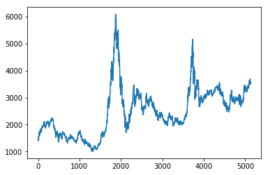
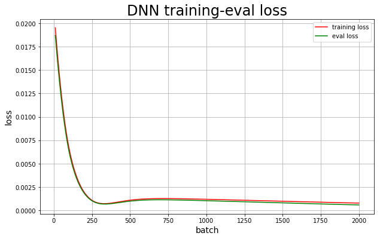
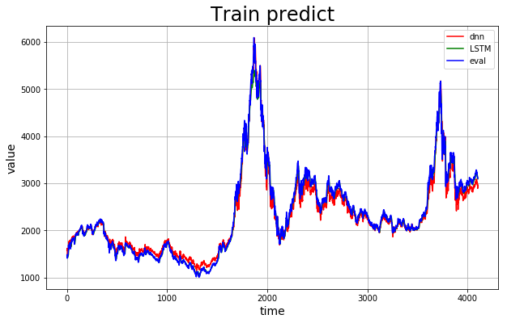
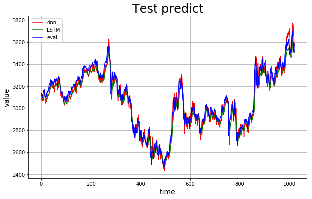

# 基于PaddlePaddle的A股预测

> 本项目尝试通过百度自研PaddlePaddle框架实现深度神经网络DNN和长短期记忆网络LSTM来对A股进行预测，使用数据为2000-2021年上证50的数据

本项目[Github仓库](https://github.com/chaoers/stock-prediction)

## 运行环境


```python
# -*- coding: utf-8 -*-

%matplotlib inline

import pandas as pd
import numpy as np
import matplotlib.pyplot as plt
from sklearn.preprocessing import MinMaxScaler

import paddle
import paddle.fluid as fluid
import paddle.fluid.layers as layers
```

### GPU(CPU)调用


```python
# place = fluid.CUDAPlace(0) # GPU环境用这个
place = fluid.CPUPlace() # CPU环境用这个
```

## 数据清洗

### 导入数据


```python
data_pd = pd.read_csv('./data/data72449/shangzheng.csv')
```

### 查看数据头部


```python
data_pd.head()
# data.tail()
# data.describe()
# data.info()
```


<div>
<style scoped>
    .dataframe tbody tr th:only-of-type {
        vertical-align: middle;
    }

    .dataframe tbody tr th {
        vertical-align: top;
    }

    .dataframe thead th {
        text-align: right;
    }
</style>
<table border="1" class="dataframe">
  <thead>
    <tr style="text-align: right;">
      <th></th>
      <th>date</th>
      <th>over</th>
      <th>begin</th>
      <th>high</th>
      <th>low</th>
      <th>trade</th>
      <th>wave</th>
    </tr>
  </thead>
  <tbody>
    <tr>
      <th>0</th>
      <td>2000年1月4日</td>
      <td>1406.37</td>
      <td>1368.69</td>
      <td>1407.52</td>
      <td>1361.21</td>
      <td>437.09M</td>
      <td>2.91%</td>
    </tr>
    <tr>
      <th>1</th>
      <td>2000年1月5日</td>
      <td>1409.68</td>
      <td>1407.83</td>
      <td>1433.78</td>
      <td>1398.32</td>
      <td>688.09M</td>
      <td>0.24%</td>
    </tr>
    <tr>
      <th>2</th>
      <td>2000年1月6日</td>
      <td>1463.94</td>
      <td>1406.04</td>
      <td>1463.95</td>
      <td>1400.25</td>
      <td>809.05M</td>
      <td>3.85%</td>
    </tr>
    <tr>
      <th>3</th>
      <td>2000年1月7日</td>
      <td>1516.60</td>
      <td>1477.15</td>
      <td>1522.83</td>
      <td>1477.15</td>
      <td>1.60B</td>
      <td>3.60%</td>
    </tr>
    <tr>
      <th>4</th>
      <td>2000年1月10日</td>
      <td>1545.11</td>
      <td>1531.71</td>
      <td>1546.72</td>
      <td>1506.40</td>
      <td>1.51B</td>
      <td>1.88%</td>
    </tr>
  </tbody>
</table>
</div>


### 异常项清洗


```python
data_pd.info() # 没有异常项需要处理
```

    <class 'pandas.core.frame.DataFrame'>
    RangeIndex: 5130 entries, 0 to 5129
    Data columns (total 7 columns):
     #   Column  Non-Null Count  Dtype  
    ---  ------  --------------  -----  
     0   date    5130 non-null   object 
     1   over    5130 non-null   float64
     2   begin   5130 non-null   float64
     3   high    5130 non-null   float64
     4   low     5130 non-null   float64
     5   trade   5130 non-null   object 
     6   wave    5130 non-null   object 
    dtypes: float64(4), object(3)
    memory usage: 280.7+ KB


### 画图查看数据


```python
plt.plot(data_pd['over'])
```

    /opt/conda/envs/python35-paddle120-env/lib/python3.7/site-packages/matplotlib/cbook/__init__.py:2349: DeprecationWarning: Using or importing the ABCs from 'collections' instead of from 'collections.abc' is deprecated, and in 3.8 it will stop working
      if isinstance(obj, collections.Iterator):
    /opt/conda/envs/python35-paddle120-env/lib/python3.7/site-packages/matplotlib/cbook/__init__.py:2366: DeprecationWarning: Using or importing the ABCs from 'collections' instead of from 'collections.abc' is deprecated, and in 3.8 it will stop working
      return list(data) if isinstance(data, collections.MappingView) else data


    [<matplotlib.lines.Line2D at 0x7fd7b39e9090>]





### 提取需要数据并格式化


```python
data_pd.set_index('date', inplace=True)
data_pd.drop(columns=['trade', 'wave'], inplace=True)
data_pd.head()
```


<div>
<style scoped>
    .dataframe tbody tr th:only-of-type {
        vertical-align: middle;
    }

    .dataframe tbody tr th {
        vertical-align: top;
    }

    .dataframe thead th {
        text-align: right;
    }
</style>
<table border="1" class="dataframe">
  <thead>
    <tr style="text-align: right;">
      <th></th>
      <th>over</th>
      <th>begin</th>
      <th>high</th>
      <th>low</th>
    </tr>
    <tr>
      <th>date</th>
      <th></th>
      <th></th>
      <th></th>
      <th></th>
    </tr>
  </thead>
  <tbody>
    <tr>
      <th>2000年1月4日</th>
      <td>1406.37</td>
      <td>1368.69</td>
      <td>1407.52</td>
      <td>1361.21</td>
    </tr>
    <tr>
      <th>2000年1月5日</th>
      <td>1409.68</td>
      <td>1407.83</td>
      <td>1433.78</td>
      <td>1398.32</td>
    </tr>
    <tr>
      <th>2000年1月6日</th>
      <td>1463.94</td>
      <td>1406.04</td>
      <td>1463.95</td>
      <td>1400.25</td>
    </tr>
    <tr>
      <th>2000年1月7日</th>
      <td>1516.60</td>
      <td>1477.15</td>
      <td>1522.83</td>
      <td>1477.15</td>
    </tr>
    <tr>
      <th>2000年1月10日</th>
      <td>1545.11</td>
      <td>1531.71</td>
      <td>1546.72</td>
      <td>1506.40</td>
    </tr>
  </tbody>
</table>
</div>


### 标准化数据

> 在这里只能通过训练集特征来对全部数据进行标准化，因为理论来说我们只知道当前时间之前的数据。详见[我的博客](https://www.asteriscum.cn/2021/03/03/53/21/), 所以这里就要确认数据集划分比例


```python
split_boundary = int(data_pd.shape[0] * 0.8)

scaler = MinMaxScaler(feature_range=(-1, 1))
scaler.fit(data_pd[:split_boundary])
data_transform = scaler.transform(data_pd)

# data_transform
```

### 建立时间滑窗，我们使用前5天数据来预测后一天的数据


```python
sequence_length = 5
delay = 1
# Generated training sequences for use in the model.
def create_sequences(values, time_steps=sequence_length+delay):
    output = []
    for i in range(len(values) - time_steps):
        output.append(values[i : (i + time_steps)])
    return np.stack(output)

data = create_sequences(data_transform)
print("Training input shape: ", data.shape)
```

    Training input shape:  (5124, 6, 4)


### 划分训练集和测试集


```python
train = data[: split_boundary]
test = data[split_boundary:]

train.shape,test.shape
```


    ((4104, 6, 4), (1020, 6, 4))


### 建立batch生成器


```python
def switch_reader(is_val: bool = False):
    def reader():
        # 判断是否是验证集
        if is_val:
            # 抽取数据使用迭代器返回
            for te in test:
                yield te[:sequence_length],te[-1:][:,0]
        else:
            # 抽取数据使用迭代器返回
            for tr in train:
                yield tr[:sequence_length],tr[-1:][:,0]#只取第0列pm2.5的值为label
        
    return reader   # 注意！此处不需要带括号
```

#### 测试batch生成器


```python
batch_size = 128
train_reader = fluid.io.batch(reader=switch_reader(), batch_size=batch_size)
val_reader = fluid.io.batch(reader=switch_reader(is_val=True), batch_size=batch_size)
for data in train_reader():
    # print(data[0].shape,data[1].shape)
    train_x=np.array([x[0] for x in data],np.float32)
    train_y = np.array([x[1] for x in data]).astype('int64')
    print(train_x.shape,train_y.shape)
```

    (128, 5, 4) (128, 1)
    (128, 5, 4) (128, 1)
    (128, 5, 4) (128, 1)
    (128, 5, 4) (128, 1)
    (128, 5, 4) (128, 1)
    (128, 5, 4) (128, 1)
    (128, 5, 4) (128, 1)
    (128, 5, 4) (128, 1)
    (128, 5, 4) (128, 1)
    (128, 5, 4) (128, 1)
    (128, 5, 4) (128, 1)
    (128, 5, 4) (128, 1)
    (128, 5, 4) (128, 1)
    (128, 5, 4) (128, 1)
    (128, 5, 4) (128, 1)
    (128, 5, 4) (128, 1)
    (128, 5, 4) (128, 1)
    (128, 5, 4) (128, 1)
    (128, 5, 4) (128, 1)
    (128, 5, 4) (128, 1)
    (128, 5, 4) (128, 1)
    (128, 5, 4) (128, 1)
    (128, 5, 4) (128, 1)
    (128, 5, 4) (128, 1)
    (128, 5, 4) (128, 1)
    (128, 5, 4) (128, 1)
    (128, 5, 4) (128, 1)
    (128, 5, 4) (128, 1)
    (128, 5, 4) (128, 1)
    (128, 5, 4) (128, 1)
    (128, 5, 4) (128, 1)
    (128, 5, 4) (128, 1)
    (8, 5, 4) (8, 1)


## DNN网络

### 定义DNN网络


```python
class MyDNNModel(fluid.dygraph.Layer):
    '''
    DNN网络
    '''
    def __init__(self):
        super(MyDNNModel,self).__init__()
        self.fc1=fluid.dygraph.Linear(5*4,10,act='relu')
        self.fc2=fluid.dygraph.Linear(10,1)
        
    def forward(self,input):        # forward 定义执行实际运行时网络的执行逻辑
        '''前向计算'''
        # print('input',input.shape)
        input =fluid.layers.reshape(input,shape=[-1,5*4])
        out=self.fc1(input)
        out=self.fc2(out)
        # print(out.shape)
        return out
```

### 损失作图函数


```python
def draw_train_loss(Batchs, train_loss,eval_loss, label=""):
    # print(len(Batchs), len(train_loss), len(eval_loss))
    plt.figure(figsize=(10, 6))
    title= label + " training-eval loss"
    plt.title(title, fontsize=24)
    plt.xlabel("batch", fontsize=14)
    plt.ylabel("loss", fontsize=14)
    plt.plot(Batchs, train_loss, color='red', label='training loss')
    plt.plot(Batchs, eval_loss, color='g', label='eval loss')
    plt.legend()
    plt.grid()
    plt.savefig('./img/'+ label + '_loss.png', dpi=300)
    plt.show()

    # print(Batchs, train_loss)
```

### 开始训练

> 注：有时训练DNN会出现损失函数反常现象，这时请再次运行训练


```python
with fluid.dygraph.guard(place):
    model=MyDNNModel() #模型实例化
    model.train() #训练模式
    # opt=fluid.optimizer.SGDOptimizer(learning_rate=train_parameters['learning_strategy']['lr'], parameter_list=model.parameters())#优化器选用SGD随机梯度下降，学习率为0.001.
    opt=fluid.optimizer.AdamOptimizer(learning_rate=0.0001, parameter_list=model.parameters()) 
    epochs_num=200#迭代次数
    batch_size = 128 * 3
    train_reader = fluid.io.batch(reader=switch_reader(), batch_size=batch_size)
    val_reader = fluid.io.batch(reader=switch_reader(is_val=True), batch_size=batch_size)
    Batch=0
    Batchs=[]
    all_train_loss=[]
    all_eval_loss=[]
    for pass_num in range(epochs_num):
        for batch_id, data in enumerate(train_reader()): 
            data_x=np.array([x[0] for x in data],np.float32)
            data_y = np.array([x[1] for x in data]).astype('float32')
            data_x = fluid.dygraph.to_variable(data_x)
            data_y = fluid.dygraph.to_variable(data_y)
        
            # print(data_x.shape, data_y.shape)

            predict=model(data_x)
            # print(predict.shape)
            loss=fluid.layers.mse_loss(predict,data_y)
            avg_loss=fluid.layers.mean(loss)#获取loss值
            avg_loss.backward()       
            opt.minimize(avg_loss)    #优化器对象的minimize方法对参数进行更新 
            model.clear_gradients()   #model.clear_gradients()来重置梯度
            if batch_id!=0 and batch_id%10==0:
                Batch = Batch+10
                Batchs.append(Batch)
                all_train_loss.append(avg_loss.numpy()[0])
                evalavg_loss=[]
                for eval_data in val_reader():
                    eval_data_x = np.array([x[0] for x in eval_data],np.float32)
                    eval_data_y = np.array([x[1] for x in eval_data]).astype('float32')

                    eval_data_x = fluid.dygraph.to_variable(eval_data_x)
                    eval_data_y = fluid.dygraph.to_variable(eval_data_y)

                    eval_predict=model(eval_data_x)
                    eval_loss=fluid.layers.mse_loss(eval_predict,eval_data_y)
                    eval_loss=fluid.layers.mean(eval_loss)
                    evalavg_loss.append(eval_loss.numpy()[0])#获取loss值
                all_eval_loss.append(sum(evalavg_loss)/len(evalavg_loss))
        print("epoch:{},batch_id:{},train_loss:{},eval_loss:{}".format(pass_num,batch_id,avg_loss.numpy(),sum(evalavg_loss)/len(evalavg_loss)))     

    fluid.save_dygraph(model.state_dict(),'./model/MyDNNModel')#保存模型
    fluid.save_dygraph(opt.state_dict(),'./model/MyDNNModel')#保存模型
    print("Final loss: {}".format(avg_loss.numpy()))    
#绘制训练图和验证损失图，以了解训练的进行情况。     
draw_train_loss(Batchs,all_train_loss,all_eval_loss, 'DNN')
```

    epoch:0,batch_id:10,train_loss:[0.00943683],eval_loss:0.008324659817541638
    epoch:1,batch_id:10,train_loss:[0.00666316],eval_loss:0.00575822366711994
    epoch:2,batch_id:10,train_loss:[0.00455487],eval_loss:0.0038302813190966845
    epoch:3,batch_id:10,train_loss:[0.00304223],eval_loss:0.0024680186567517617
    epoch:4,batch_id:10,train_loss:[0.00203338],eval_loss:0.0015793565932350855
    epoch:5,batch_id:10,train_loss:[0.00142026],eval_loss:0.0010583313123788685
    epoch:6,batch_id:10,train_loss:[0.00109477],eval_loss:0.000800652390656372
    epoch:7,batch_id:10,train_loss:[0.00096088],eval_loss:0.0007148502045311034
    epoch:8,batch_id:10,train_loss:[0.00094103],eval_loss:0.0007278764775643746
    epoch:9,batch_id:10,train_loss:[0.0009787],eval_loss:0.0007871450701107582
    epoch:10,batch_id:10,train_loss:[0.00103715],eval_loss:0.0008587861860481402
    epoch:11,batch_id:10,train_loss:[0.0010949],eval_loss:0.0009239346254616976
    epoch:12,batch_id:10,train_loss:[0.00114178],eval_loss:0.0009743596310727298
    epoch:13,batch_id:10,train_loss:[0.00117483],eval_loss:0.001008447240261982
    epoch:14,batch_id:10,train_loss:[0.00119497],eval_loss:0.0010280325659550726
    epoch:15,batch_id:10,train_loss:[0.00120476],eval_loss:0.0010362795437686145
    epoch:16,batch_id:10,train_loss:[0.00120704],eval_loss:0.0010364070573511224
    epoch:17,batch_id:10,train_loss:[0.00120432],eval_loss:0.0010311497026123106
    epoch:18,batch_id:10,train_loss:[0.00119848],eval_loss:0.001022523521290471
    epoch:19,batch_id:10,train_loss:[0.00119089],eval_loss:0.0010120110431065161
    epoch:20,batch_id:10,train_loss:[0.00118242],eval_loss:0.0010005366251183052
    epoch:21,batch_id:10,train_loss:[0.00117361],eval_loss:0.0009886579161199431
    epoch:22,batch_id:10,train_loss:[0.00116475],eval_loss:0.000976672861725092
    epoch:23,batch_id:10,train_loss:[0.00115598],eval_loss:0.0009647408733144403
    epoch:24,batch_id:10,train_loss:[0.00114737],eval_loss:0.0009529314120300114
    epoch:25,batch_id:10,train_loss:[0.00113894],eval_loss:0.0009412847575731575
    epoch:26,batch_id:10,train_loss:[0.00113071],eval_loss:0.0009298118917892376
    epoch:27,batch_id:10,train_loss:[0.00112271],eval_loss:0.0009185203040639559
    epoch:28,batch_id:10,train_loss:[0.00111492],eval_loss:0.0009074087138287723
    epoch:29,batch_id:10,train_loss:[0.00110732],eval_loss:0.0008964748121798038
    epoch:30,batch_id:10,train_loss:[0.00109984],eval_loss:0.000885721684123079
    epoch:31,batch_id:10,train_loss:[0.00109251],eval_loss:0.0008751550534119209
    epoch:32,batch_id:10,train_loss:[0.00108541],eval_loss:0.0008647836123903593
    epoch:33,batch_id:10,train_loss:[0.00107856],eval_loss:0.0008546096893648306
    epoch:34,batch_id:10,train_loss:[0.00107191],eval_loss:0.000844640308059752
    epoch:35,batch_id:10,train_loss:[0.00106552],eval_loss:0.0008348786116888126
    epoch:36,batch_id:10,train_loss:[0.00105936],eval_loss:0.0008253340104905268
    epoch:37,batch_id:10,train_loss:[0.0010534],eval_loss:0.0008159811259247363
    epoch:38,batch_id:10,train_loss:[0.00104764],eval_loss:0.00080680608516559
    epoch:39,batch_id:10,train_loss:[0.0010421],eval_loss:0.0007978402039346596
    epoch:40,batch_id:10,train_loss:[0.00103677],eval_loss:0.0007890920193555454
    epoch:41,batch_id:10,train_loss:[0.00103164],eval_loss:0.0007805556330519418
    epoch:42,batch_id:10,train_loss:[0.0010267],eval_loss:0.000772239058278501
    epoch:43,batch_id:10,train_loss:[0.00102197],eval_loss:0.0007641427412939569
    epoch:44,batch_id:10,train_loss:[0.00101745],eval_loss:0.0007562539734256765
    epoch:45,batch_id:10,train_loss:[0.00101313],eval_loss:0.0007485762083282074
    epoch:46,batch_id:10,train_loss:[0.00100899],eval_loss:0.0007411155190008382
    epoch:47,batch_id:10,train_loss:[0.00100505],eval_loss:0.0007338679279200733
    epoch:48,batch_id:10,train_loss:[0.00100129],eval_loss:0.0007268357633923491
    epoch:49,batch_id:10,train_loss:[0.00099772],eval_loss:0.0007200140389613807
    epoch:50,batch_id:10,train_loss:[0.00099433],eval_loss:0.000713405762022982
    epoch:51,batch_id:10,train_loss:[0.00099111],eval_loss:0.0007070382707752287
    epoch:52,batch_id:10,train_loss:[0.00098807],eval_loss:0.000700878018202881
    epoch:53,batch_id:10,train_loss:[0.00098513],eval_loss:0.0006949195521883667
    epoch:54,batch_id:10,train_loss:[0.00098235],eval_loss:0.0006891544714259604
    epoch:55,batch_id:10,train_loss:[0.00097974],eval_loss:0.0006835907115601003
    epoch:56,batch_id:10,train_loss:[0.00097728],eval_loss:0.0006782248383387923
    epoch:57,batch_id:10,train_loss:[0.00097499],eval_loss:0.0006730507399576405
    epoch:58,batch_id:10,train_loss:[0.00097285],eval_loss:0.0006680660687076548
    epoch:59,batch_id:10,train_loss:[0.00097087],eval_loss:0.0006632683798670769
    epoch:60,batch_id:10,train_loss:[0.00096903],eval_loss:0.0006586532884587845
    epoch:61,batch_id:10,train_loss:[0.00096735],eval_loss:0.0006542184661763409
    epoch:62,batch_id:10,train_loss:[0.0009658],eval_loss:0.0006499586549277107
    epoch:63,batch_id:10,train_loss:[0.00096439],eval_loss:0.0006458722443009416
    epoch:64,batch_id:10,train_loss:[0.00096311],eval_loss:0.0006419789084854225
    epoch:65,batch_id:10,train_loss:[0.00096196],eval_loss:0.0006382801220752299
    epoch:66,batch_id:10,train_loss:[0.00096093],eval_loss:0.0006347402037742237
    epoch:67,batch_id:10,train_loss:[0.00096004],eval_loss:0.0006313566700555384
    epoch:68,batch_id:10,train_loss:[0.00095925],eval_loss:0.000628123622542868
    epoch:69,batch_id:10,train_loss:[0.00095858],eval_loss:0.0006250384806965789
    epoch:70,batch_id:10,train_loss:[0.00095802],eval_loss:0.0006220924163547655
    epoch:71,batch_id:10,train_loss:[0.00095756],eval_loss:0.0006192753983971974
    epoch:72,batch_id:10,train_loss:[0.0009572],eval_loss:0.0006165936744461457
    epoch:73,batch_id:10,train_loss:[0.00095693],eval_loss:0.0006140431602640698
    epoch:74,batch_id:10,train_loss:[0.00095676],eval_loss:0.0006116202566772699
    epoch:75,batch_id:10,train_loss:[0.00095669],eval_loss:0.0006093201033460597
    epoch:76,batch_id:10,train_loss:[0.00095669],eval_loss:0.0006071397801861167
    epoch:77,batch_id:10,train_loss:[0.00095679],eval_loss:0.0006050728940560172
    epoch:78,batch_id:10,train_loss:[0.00095695],eval_loss:0.0006031176987259338
    epoch:79,batch_id:10,train_loss:[0.00095719],eval_loss:0.0006012666854076087
    epoch:80,batch_id:10,train_loss:[0.0009575],eval_loss:0.0005995211249683052
    epoch:81,batch_id:10,train_loss:[0.00095788],eval_loss:0.0005978747697857519
    epoch:82,batch_id:10,train_loss:[0.00095831],eval_loss:0.0005963251363330831
    epoch:83,batch_id:10,train_loss:[0.0009588],eval_loss:0.0005948582644729564
    epoch:84,batch_id:10,train_loss:[0.00095934],eval_loss:0.0005934809353978684
    epoch:85,batch_id:10,train_loss:[0.00095994],eval_loss:0.0005921902581273267
    epoch:86,batch_id:10,train_loss:[0.00096058],eval_loss:0.0005909825558774173
    epoch:87,batch_id:10,train_loss:[0.00096127],eval_loss:0.0005898561115221431
    epoch:88,batch_id:10,train_loss:[0.000962],eval_loss:0.0005888042602843294
    epoch:89,batch_id:10,train_loss:[0.00096277],eval_loss:0.0005878259059196959
    epoch:90,batch_id:10,train_loss:[0.00096357],eval_loss:0.0005869182156554112
    epoch:91,batch_id:10,train_loss:[0.00096441],eval_loss:0.0005860779201611876
    epoch:92,batch_id:10,train_loss:[0.00096528],eval_loss:0.0005853016724965224
    epoch:93,batch_id:10,train_loss:[0.00096617],eval_loss:0.0005845869988358269
    epoch:94,batch_id:10,train_loss:[0.0009671],eval_loss:0.0005839312507305294
    epoch:95,batch_id:10,train_loss:[0.00096804],eval_loss:0.0005833339334155122
    epoch:96,batch_id:10,train_loss:[0.00096901],eval_loss:0.0005827903223689646
    epoch:97,batch_id:10,train_loss:[0.00097],eval_loss:0.000582298137790834
    epoch:98,batch_id:10,train_loss:[0.000971],eval_loss:0.0005818560118010888
    epoch:99,batch_id:10,train_loss:[0.00097202],eval_loss:0.0005814612280422201
    epoch:100,batch_id:10,train_loss:[0.00097306],eval_loss:0.0005811125253482411
    epoch:101,batch_id:10,train_loss:[0.0009741],eval_loss:0.0005808069933361063
    epoch:102,batch_id:10,train_loss:[0.00097516],eval_loss:0.0005805469312084218
    epoch:103,batch_id:10,train_loss:[0.00097622],eval_loss:0.0005803300397625814
    epoch:104,batch_id:10,train_loss:[0.00097729],eval_loss:0.000580150110181421
    epoch:105,batch_id:10,train_loss:[0.00097836],eval_loss:0.0005800061723372588
    epoch:106,batch_id:10,train_loss:[0.00097944],eval_loss:0.0005798967613372952
    epoch:107,batch_id:10,train_loss:[0.00098052],eval_loss:0.0005798190444086989
    epoch:108,batch_id:10,train_loss:[0.0009816],eval_loss:0.0005797734775114805
    epoch:109,batch_id:10,train_loss:[0.00098268],eval_loss:0.0005797597016983976
    epoch:110,batch_id:10,train_loss:[0.00098377],eval_loss:0.0005797723521633694
    epoch:111,batch_id:10,train_loss:[0.00098485],eval_loss:0.0005798097214816759
    epoch:112,batch_id:10,train_loss:[0.00098592],eval_loss:0.0005798724790414175
    epoch:113,batch_id:10,train_loss:[0.00098699],eval_loss:0.0005799601494800299
    epoch:114,batch_id:10,train_loss:[0.00098806],eval_loss:0.0005800716171506792
    epoch:115,batch_id:10,train_loss:[0.00098911],eval_loss:0.0005802040007741501
    epoch:116,batch_id:10,train_loss:[0.00099017],eval_loss:0.0005803571839351207
    epoch:117,batch_id:10,train_loss:[0.00099121],eval_loss:0.0005805300218829265
    epoch:118,batch_id:10,train_loss:[0.00099224],eval_loss:0.0005807211467375358
    epoch:119,batch_id:10,train_loss:[0.00099326],eval_loss:0.0005809295107610524
    epoch:120,batch_id:10,train_loss:[0.00099427],eval_loss:0.0005811548617202789
    epoch:121,batch_id:10,train_loss:[0.00099527],eval_loss:0.0005813962585913638
    epoch:122,batch_id:10,train_loss:[0.00099626],eval_loss:0.0005816529834798226
    epoch:123,batch_id:10,train_loss:[0.00099724],eval_loss:0.0005819242214784026
    epoch:124,batch_id:10,train_loss:[0.0009982],eval_loss:0.000582207702488328
    epoch:125,batch_id:10,train_loss:[0.00099914],eval_loss:0.0005825033197955539
    epoch:126,batch_id:10,train_loss:[0.00100004],eval_loss:0.0005828106756477306
    epoch:127,batch_id:10,train_loss:[0.00100094],eval_loss:0.0005831290715529273
    epoch:128,batch_id:10,train_loss:[0.00100182],eval_loss:0.0005834590119775385
    epoch:129,batch_id:10,train_loss:[0.00100268],eval_loss:0.0005838000700653841
    epoch:130,batch_id:10,train_loss:[0.00100353],eval_loss:0.0005841507615211109
    epoch:131,batch_id:10,train_loss:[0.00100437],eval_loss:0.000584502995479852
    epoch:132,batch_id:10,train_loss:[0.0010052],eval_loss:0.0005848610211008539
    epoch:133,batch_id:10,train_loss:[0.00100601],eval_loss:0.0005852293591791143
    epoch:134,batch_id:10,train_loss:[0.0010068],eval_loss:0.0005856105223453293
    epoch:135,batch_id:10,train_loss:[0.00100758],eval_loss:0.0005859986607295772
    epoch:136,batch_id:10,train_loss:[0.00100835],eval_loss:0.000586393007930989
    epoch:137,batch_id:10,train_loss:[0.0010091],eval_loss:0.00058679217666698
    epoch:138,batch_id:10,train_loss:[0.00100983],eval_loss:0.0005871975639214119
    epoch:139,batch_id:10,train_loss:[0.00101055],eval_loss:0.0005876083256832013
    epoch:140,batch_id:10,train_loss:[0.00101125],eval_loss:0.000588022240359957
    epoch:141,batch_id:10,train_loss:[0.00101194],eval_loss:0.0005884410444802294
    epoch:142,batch_id:10,train_loss:[0.00101262],eval_loss:0.0005888626134643952
    epoch:143,batch_id:10,train_loss:[0.00101328],eval_loss:0.0005892878592324754
    epoch:144,batch_id:10,train_loss:[0.00101392],eval_loss:0.0005897180526517332
    epoch:145,batch_id:10,train_loss:[0.00101456],eval_loss:0.000590151185557867
    epoch:146,batch_id:10,train_loss:[0.00101517],eval_loss:0.0005905875683917353
    epoch:147,batch_id:10,train_loss:[0.00101577],eval_loss:0.0005910292093176395
    epoch:148,batch_id:10,train_loss:[0.00101636],eval_loss:0.0005914749150785307
    epoch:149,batch_id:10,train_loss:[0.00101693],eval_loss:0.0005919237446505576
    epoch:150,batch_id:10,train_loss:[0.00101749],eval_loss:0.0005923757368388275
    epoch:151,batch_id:10,train_loss:[0.00101803],eval_loss:0.0005928270305351665
    epoch:152,batch_id:10,train_loss:[0.00101855],eval_loss:0.0005932792652553568
    epoch:153,batch_id:10,train_loss:[0.00101907],eval_loss:0.0005937340514113506
    epoch:154,batch_id:10,train_loss:[0.00101956],eval_loss:0.0005941884689188252
    epoch:155,batch_id:10,train_loss:[0.00102004],eval_loss:0.0005946424886739502
    epoch:156,batch_id:10,train_loss:[0.00102051],eval_loss:0.0005950963338060925
    epoch:157,batch_id:10,train_loss:[0.00102096],eval_loss:0.0005955496453680098
    epoch:158,batch_id:10,train_loss:[0.00102139],eval_loss:0.0005960024136584252
    epoch:159,batch_id:10,train_loss:[0.00102181],eval_loss:0.0005964540080943456
    epoch:160,batch_id:10,train_loss:[0.00102222],eval_loss:0.0005969048652332276
    epoch:161,batch_id:10,train_loss:[0.00102261],eval_loss:0.0005973553537235906
    epoch:162,batch_id:10,train_loss:[0.00102299],eval_loss:0.0005978034265960256
    epoch:163,batch_id:10,train_loss:[0.00102335],eval_loss:0.000598250781573976
    epoch:164,batch_id:10,train_loss:[0.0010237],eval_loss:0.0005986945082743963
    epoch:165,batch_id:10,train_loss:[0.00102404],eval_loss:0.0005991367215756327
    epoch:166,batch_id:10,train_loss:[0.00102436],eval_loss:0.0005995780617619554
    epoch:167,batch_id:10,train_loss:[0.00102467],eval_loss:0.0006000144154919932
    epoch:168,batch_id:10,train_loss:[0.00102496],eval_loss:0.0006004499640160551
    epoch:169,batch_id:10,train_loss:[0.00102524],eval_loss:0.000600885939396297
    epoch:170,batch_id:10,train_loss:[0.00102551],eval_loss:0.0006013158805823574
    epoch:171,batch_id:10,train_loss:[0.00102576],eval_loss:0.0006017415920117249
    epoch:172,batch_id:10,train_loss:[0.00102601],eval_loss:0.000602164160227403
    epoch:173,batch_id:10,train_loss:[0.00102623],eval_loss:0.0006025860105485966
    epoch:174,batch_id:10,train_loss:[0.00102645],eval_loss:0.0006030048825778067
    epoch:175,batch_id:10,train_loss:[0.00102665],eval_loss:0.0006034181472690155
    epoch:176,batch_id:10,train_loss:[0.00102684],eval_loss:0.0006038273277226835
    epoch:177,batch_id:10,train_loss:[0.00102702],eval_loss:0.000604231773953264
    epoch:178,batch_id:10,train_loss:[0.00102718],eval_loss:0.0006046310785071304
    epoch:179,batch_id:10,train_loss:[0.00102733],eval_loss:0.0006050248145281026
    epoch:180,batch_id:10,train_loss:[0.00102747],eval_loss:0.0006054126521727691
    epoch:181,batch_id:10,train_loss:[0.0010276],eval_loss:0.0006057946302462369
    epoch:182,batch_id:10,train_loss:[0.00102771],eval_loss:0.0006061706323331842
    epoch:183,batch_id:10,train_loss:[0.0010278],eval_loss:0.0006065448299826434
    epoch:184,batch_id:10,train_loss:[0.00102789],eval_loss:0.0006069123337510973
    epoch:185,batch_id:10,train_loss:[0.00102796],eval_loss:0.0006072728623015186
    epoch:186,batch_id:10,train_loss:[0.00102802],eval_loss:0.0006076260081802806
    epoch:187,batch_id:10,train_loss:[0.00102807],eval_loss:0.0006079745459525535
    epoch:188,batch_id:10,train_loss:[0.00102811],eval_loss:0.0006083166129731884
    epoch:189,batch_id:10,train_loss:[0.00102813],eval_loss:0.0006086515204515308
    epoch:190,batch_id:10,train_loss:[0.00102815],eval_loss:0.00060897878332374
    epoch:191,batch_id:10,train_loss:[0.00102814],eval_loss:0.0006092961896987011
    epoch:192,batch_id:10,train_loss:[0.00102813],eval_loss:0.00060960707681564
    epoch:193,batch_id:10,train_loss:[0.00102811],eval_loss:0.0006099107170787951
    epoch:194,batch_id:10,train_loss:[0.00102807],eval_loss:0.0006102057814132422
    epoch:195,batch_id:10,train_loss:[0.00102803],eval_loss:0.0006104930944275111
    epoch:196,batch_id:10,train_loss:[0.00102797],eval_loss:0.0006107731314841658
    epoch:197,batch_id:10,train_loss:[0.0010279],eval_loss:0.0006110434478614479
    epoch:198,batch_id:10,train_loss:[0.00102783],eval_loss:0.0006113067696181437
    epoch:199,batch_id:10,train_loss:[0.00102774],eval_loss:0.0006115617579780519
    Final loss: [0.00102774]





## LSTM网络

### 定义LSTM网络


```python
import paddle.fluid as fluid
class MyLSTMModel(fluid.dygraph.Layer):
    '''
    LSTM网络
    '''
    def __init__(self):
        super(MyLSTMModel,self).__init__()
        self.rnn = paddle.nn.LSTM(4, 20, 2)
        self.flatten = paddle.nn.Flatten()
        self.fc1=fluid.dygraph.Linear(5*20,10)
        self.fc2=fluid.dygraph.Linear(10,1)

        
    def forward(self,input):        # forward 定义执行实际运行时网络的执行逻辑
        '''前向计算'''
        # print('input',input.shape)
        out, (h, c)=self.rnn(input)
        out =self.flatten(out)
        out=self.fc1(out)
        out=self.fc2(out)
        return out
```

### 开始训练


```python
with fluid.dygraph.guard(place):
    model=MyLSTMModel() #模型实例化
    # model=MyModel()
    model.train() #训练模式
    # opt=fluid.optimizer.SGDOptimizer(learning_rate=0.001, parameter_list=model.parameters())#优化器选用SGD随机梯度下降，学习率为0.001.
    opt=fluid.optimizer.AdamOptimizer(learning_rate=0.01, parameter_list=model.parameters()) 
    epochs_num=100#迭代次数
    batch_size = 128*3
    train_reader = fluid.io.batch(reader=switch_reader(), batch_size=batch_size)
    val_reader = fluid.io.batch(reader=switch_reader(is_val=True), batch_size=batch_size)
    Batch=0
    Batchs=[]
    all_train_loss=[]
    all_eval_loss=[]
    for pass_num in range(epochs_num):
        for batch_id, data in enumerate(train_reader()): 
            data_x=np.array([x[0] for x in data],np.float32)
            data_y = np.array([x[1] for x in data]).astype('float32')
            data_x = fluid.dygraph.to_variable(data_x)
            data_y = fluid.dygraph.to_variable(data_y)
        
            # print(data_x.shape, data_y.shape)

            predict=model(data_x)
            # print(predict.shape)
            loss=fluid.layers.mse_loss(predict,data_y)
            avg_loss=fluid.layers.mean(loss)#获取loss值
            avg_loss.backward()       
            opt.minimize(avg_loss)    #优化器对象的minimize方法对参数进行更新 
            model.clear_gradients()   #model.clear_gradients()来重置梯度
            if batch_id!=0 and batch_id%10==0:
                Batch = Batch+10
                Batchs.append(Batch)
                all_train_loss.append(avg_loss.numpy()[0])
                evalavg_loss=[]
                for eval_data in val_reader():
                    eval_data_x = np.array([x[0] for x in eval_data],np.float32)
                    eval_data_y = np.array([x[1] for x in eval_data]).astype('float32')

                    eval_data_x = fluid.dygraph.to_variable(eval_data_x)
                    eval_data_y = fluid.dygraph.to_variable(eval_data_y)

                    eval_predict=model(eval_data_x)
                    eval_loss=fluid.layers.mse_loss(eval_predict,eval_data_y)
                    eval_loss=fluid.layers.mean(eval_loss)
                    evalavg_loss.append(eval_loss.numpy()[0])#获取loss值
                all_eval_loss.append(sum(evalavg_loss)/len(evalavg_loss))
        print("epoch:{},batch_id:{},train_loss:{},eval_loss:{}".format(pass_num,batch_id,avg_loss.numpy(),sum(evalavg_loss)/len(evalavg_loss)))     

    fluid.save_dygraph(model.state_dict(),'./model/MyLSTMModel')#保存模型
    fluid.save_dygraph(opt.state_dict(),'./model/MyLSTMModel')#保存模型
    print("Final loss: {}".format(avg_loss.numpy()))    
#让我们绘制训练图和验证损失图，以了解训练的进行情况。     
draw_train_loss(Batchs,all_train_loss,all_eval_loss, 'LSTM')
```

    epoch:0,batch_id:10,train_loss:[0.02328011],eval_loss:0.03692121555407842
    epoch:1,batch_id:10,train_loss:[0.05825887],eval_loss:0.03277343697845936
    epoch:2,batch_id:10,train_loss:[0.00764907],eval_loss:0.01722867600619793
    epoch:3,batch_id:10,train_loss:[0.00988212],eval_loss:0.007318180985748768
    epoch:4,batch_id:10,train_loss:[0.0008091],eval_loss:0.001431947690434754
    epoch:5,batch_id:10,train_loss:[0.00110962],eval_loss:0.0006655518373008817
    epoch:6,batch_id:10,train_loss:[0.00120124],eval_loss:0.0006069704929056267
    epoch:7,batch_id:10,train_loss:[0.00417768],eval_loss:0.003968538638825218
    epoch:8,batch_id:10,train_loss:[0.00132585],eval_loss:0.0008432210597675294
    epoch:9,batch_id:10,train_loss:[0.0010052],eval_loss:0.0010523064993321896
    epoch:10,batch_id:10,train_loss:[0.001807],eval_loss:0.0006540715112350881
    epoch:11,batch_id:10,train_loss:[0.00189963],eval_loss:0.0020179497466112175
    epoch:12,batch_id:10,train_loss:[0.00119211],eval_loss:0.0009217111898275713
    epoch:13,batch_id:10,train_loss:[0.00099414],eval_loss:0.0007465910360527536
    epoch:14,batch_id:10,train_loss:[0.00180425],eval_loss:0.0006295940353690336
    epoch:15,batch_id:10,train_loss:[0.00423808],eval_loss:0.004059579378614823
    epoch:16,batch_id:10,train_loss:[0.00119707],eval_loss:0.0010386690070542197
    epoch:17,batch_id:10,train_loss:[0.00114556],eval_loss:0.0007615173623586694
    epoch:18,batch_id:10,train_loss:[0.00146776],eval_loss:0.0014157730426328878
    epoch:19,batch_id:10,train_loss:[0.00121006],eval_loss:0.0006305429948649058
    epoch:20,batch_id:10,train_loss:[0.00094323],eval_loss:0.0006076810241211206
    epoch:21,batch_id:10,train_loss:[0.00094104],eval_loss:0.0005357782841504862
    epoch:22,batch_id:10,train_loss:[0.00096513],eval_loss:0.0005450729416528096
    epoch:23,batch_id:10,train_loss:[0.00140221],eval_loss:0.0006453681465548774
    epoch:24,batch_id:10,train_loss:[0.00078356],eval_loss:0.0006504528088650355
    epoch:25,batch_id:10,train_loss:[0.00100134],eval_loss:0.0005360431484101961
    epoch:26,batch_id:10,train_loss:[0.00095297],eval_loss:0.0005928264678611109
    epoch:27,batch_id:10,train_loss:[0.00105902],eval_loss:0.0005272335547488183
    epoch:28,batch_id:10,train_loss:[0.00074805],eval_loss:0.0006434720708057284
    epoch:29,batch_id:10,train_loss:[0.0011575],eval_loss:0.0006181303663955381
    epoch:30,batch_id:10,train_loss:[0.00123344],eval_loss:0.0011208847281523049
    epoch:31,batch_id:10,train_loss:[0.00087844],eval_loss:0.0006636753484296302
    epoch:32,batch_id:10,train_loss:[0.0007351],eval_loss:0.0007151845493353903
    epoch:33,batch_id:10,train_loss:[0.00169748],eval_loss:0.0009200433269143105
    epoch:34,batch_id:10,train_loss:[0.00264054],eval_loss:0.0030242576419065395
    epoch:35,batch_id:10,train_loss:[0.00077205],eval_loss:0.0015478451969102025
    epoch:36,batch_id:10,train_loss:[0.0008509],eval_loss:0.0007385939728313436
    epoch:37,batch_id:10,train_loss:[0.00104165],eval_loss:0.0005099086071519802
    epoch:38,batch_id:10,train_loss:[0.0013276],eval_loss:0.001038911616584907
    epoch:39,batch_id:10,train_loss:[0.00075805],eval_loss:0.0008598061588903269
    epoch:40,batch_id:10,train_loss:[0.00070101],eval_loss:0.000547018920769915
    epoch:41,batch_id:10,train_loss:[0.00456443],eval_loss:0.0026986361481249332
    epoch:42,batch_id:10,train_loss:[0.00762047],eval_loss:0.00785302355264624
    epoch:43,batch_id:10,train_loss:[0.00138029],eval_loss:0.004736061440780759
    epoch:44,batch_id:10,train_loss:[0.00070353],eval_loss:0.0007937151725248744
    epoch:45,batch_id:10,train_loss:[0.00366116],eval_loss:0.002716484401995937
    epoch:46,batch_id:10,train_loss:[0.00182774],eval_loss:0.001765368312286834
    epoch:47,batch_id:10,train_loss:[0.00074545],eval_loss:0.0010489148747486372
    epoch:48,batch_id:10,train_loss:[0.00081453],eval_loss:0.00048533882363699377
    epoch:49,batch_id:10,train_loss:[0.00134738],eval_loss:0.0010543342020052175
    epoch:50,batch_id:10,train_loss:[0.00136355],eval_loss:0.0009722658627045652
    epoch:51,batch_id:10,train_loss:[0.00082447],eval_loss:0.0006229335364575187
    epoch:52,batch_id:10,train_loss:[0.00085476],eval_loss:0.0005056830996181816
    epoch:53,batch_id:10,train_loss:[0.00129981],eval_loss:0.0006826621732519319
    epoch:54,batch_id:10,train_loss:[0.0008008],eval_loss:0.00047117330056304735
    epoch:55,batch_id:10,train_loss:[0.00078671],eval_loss:0.00047713345459972817
    epoch:56,batch_id:10,train_loss:[0.00071493],eval_loss:0.0004610447116040935
    epoch:57,batch_id:10,train_loss:[0.00075395],eval_loss:0.0005262044044987609
    epoch:58,batch_id:10,train_loss:[0.00085524],eval_loss:0.0005173700822827717
    epoch:59,batch_id:10,train_loss:[0.00066735],eval_loss:0.0005861026778196295
    epoch:60,batch_id:10,train_loss:[0.00067591],eval_loss:0.0004490488111817588
    epoch:61,batch_id:10,train_loss:[0.00080364],eval_loss:0.0006242312859588613
    epoch:62,batch_id:10,train_loss:[0.00098736],eval_loss:0.0006423024848724405
    epoch:63,batch_id:10,train_loss:[0.00068465],eval_loss:0.0008834796608425677
    epoch:64,batch_id:10,train_loss:[0.00065218],eval_loss:0.00045269643305800855
    epoch:65,batch_id:10,train_loss:[0.00091296],eval_loss:0.0006931466632522643
    epoch:66,batch_id:10,train_loss:[0.00109183],eval_loss:0.0008312067754256228
    epoch:67,batch_id:10,train_loss:[0.00067519],eval_loss:0.0010758257121779025
    epoch:68,batch_id:10,train_loss:[0.00064257],eval_loss:0.00046002296342824894
    epoch:69,batch_id:10,train_loss:[0.00166534],eval_loss:0.0015207025959777336
    epoch:70,batch_id:10,train_loss:[0.00298861],eval_loss:0.003320633744200071
    epoch:71,batch_id:10,train_loss:[0.00108369],eval_loss:0.0026191940220693746
    epoch:72,batch_id:10,train_loss:[0.0006511],eval_loss:0.0005084178992547095
    epoch:73,batch_id:10,train_loss:[0.00163922],eval_loss:0.0015250045495728652
    epoch:74,batch_id:10,train_loss:[0.0030231],eval_loss:0.003945378897090753
    epoch:75,batch_id:10,train_loss:[0.0008896],eval_loss:0.0019328655519833167
    epoch:76,batch_id:10,train_loss:[0.00063112],eval_loss:0.00044881228435163695
    epoch:77,batch_id:10,train_loss:[0.00107965],eval_loss:0.0010765414723816018
    epoch:78,batch_id:10,train_loss:[0.00107338],eval_loss:0.0015682933541635673
    epoch:79,batch_id:10,train_loss:[0.00067262],eval_loss:0.0005744606217679878
    epoch:80,batch_id:10,train_loss:[0.00069704],eval_loss:0.00042643590131774545
    epoch:81,batch_id:10,train_loss:[0.00068256],eval_loss:0.000877209531608969
    epoch:82,batch_id:10,train_loss:[0.00076568],eval_loss:0.00046102163711717975
    epoch:83,batch_id:10,train_loss:[0.00075516],eval_loss:0.0005504683843658617
    epoch:84,batch_id:10,train_loss:[0.00076192],eval_loss:0.0004545639142937337
    epoch:85,batch_id:10,train_loss:[0.00062061],eval_loss:0.0007379962868678073
    epoch:86,batch_id:10,train_loss:[0.00083749],eval_loss:0.00046529091196134686
    epoch:87,batch_id:10,train_loss:[0.00085159],eval_loss:0.00040861057156386477
    epoch:88,batch_id:10,train_loss:[0.00111485],eval_loss:0.0005449746871211877
    epoch:89,batch_id:10,train_loss:[0.00062848],eval_loss:0.001020072668325156
    epoch:90,batch_id:10,train_loss:[0.00060894],eval_loss:0.0005044837016612291
    epoch:91,batch_id:10,train_loss:[0.00325805],eval_loss:0.0017770301007355254
    epoch:92,batch_id:10,train_loss:[0.00351625],eval_loss:0.0029473040097703538
    epoch:93,batch_id:10,train_loss:[0.00087297],eval_loss:0.002547805313952267
    epoch:94,batch_id:10,train_loss:[0.00092763],eval_loss:0.0015000431643178065
    epoch:95,batch_id:10,train_loss:[0.00486435],eval_loss:0.0044911501463502645
    epoch:96,batch_id:10,train_loss:[0.00221457],eval_loss:0.002853055135346949
    epoch:97,batch_id:10,train_loss:[0.00083081],eval_loss:0.002566129978125294
    epoch:98,batch_id:10,train_loss:[0.00062287],eval_loss:0.0007506457041017711
    epoch:99,batch_id:10,train_loss:[0.00097264],eval_loss:0.0006060876379099985
    Final loss: [0.00097264]


## 训练结果

### 预测结果

#### 数据集还原函数

> 开始时标准化的数据需要在实际作图时还原


```python
def inverse_transform(arr):
    zero_arr = np.zeros((arr.shape[0], 3))
    zero_data = np.hstack((arr, zero_arr))
    # print(zero_data)
    zero_data = scaler.inverse_transform(zero_data)
    # print(zero_data)
    
    return zero_data[:, 0]

```

#### 训练集数据预测结果


```python
with fluid.dygraph.guard(place):
    accs = []
    dnn_predict = []
    model_lstm_dict, _ = fluid.load_dygraph('./model/MyLSTMModel.pdopt')
    model_dnn_dict, _ = fluid.load_dygraph('./model/MyDNNModel.pdopt')
    model_lstm = MyLSTMModel()
    model_dnn = MyDNNModel()
    model_lstm.load_dict(model_lstm_dict)
    model_dnn.load_dict(model_dnn_dict) #加载模型参数

    train_reader = fluid.io.batch(reader=switch_reader(is_val=False), batch_size=train.shape[0])
    train_data_x = np.array([x[0] for x in next(train_reader())],np.float32)
    train_data_y = np.array([x[1] for x in next(train_reader())]).astype('float32')

    train_data_x = fluid.dygraph.to_variable(train_data_x)
    train_data_y = fluid.dygraph.to_variable(train_data_y)

    train_dnn=model_dnn(train_data_x)
    train_lstm=model_lstm(train_data_x)

plt.figure(figsize=(10, 6))
title="Train predict"
plt.title(title, fontsize=24)
plt.xlabel("time", fontsize=14)
plt.ylabel("value", fontsize=14)
plt.plot(range(train.shape[0]), inverse_transform(train_dnn.numpy()), color='red', label='dnn')
plt.plot(range(train.shape[0]), inverse_transform(train_lstm.numpy()), color='g', label='LSTM')
plt.plot(range(train.shape[0]), inverse_transform(train_data_y.numpy()), color='b', label='eval')
plt.legend()
plt.grid()
plt.savefig('./img/train_res.png', dpi=300)
plt.show()
```





#### 验证集预测结果


```python
with fluid.dygraph.guard(place):
    accs = []
    dnn_predict = []
    model_lstm_dict, _ = fluid.load_dygraph('./model/MyLSTMModel.pdopt')
    model_dnn_dict, _ = fluid.load_dygraph('./model/MyDNNModel.pdopt')
    model_lstm = MyLSTMModel()
    model_dnn = MyDNNModel()
    model_lstm.load_dict(model_lstm_dict)
    model_dnn.load_dict(model_dnn_dict) #加载模型参数

    val_reader = fluid.io.batch(reader=switch_reader(is_val=True), batch_size=test.shape[0])
    # print(len(next(val_reader())))
    eval_data_x = np.array([x[0] for x in next(val_reader())],np.float32)
    eval_data_y = np.array([x[1] for x in next(val_reader())]).astype('float32')

    eval_data_x = fluid.dygraph.to_variable(eval_data_x)
    eval_data_y = fluid.dygraph.to_variable(eval_data_y)

    eval_dnn=model_dnn(eval_data_x)
    eval_lstm=model_lstm(eval_data_x)

plt.figure(figsize=(10, 6))
title="Test predict"
plt.title(title, fontsize=24)
plt.xlabel("time", fontsize=14)
plt.ylabel("value", fontsize=14)
plt.plot(range(test.shape[0]), inverse_transform(eval_dnn.numpy()), color='red', label='dnn')
plt.plot(range(test.shape[0]), inverse_transform(eval_lstm.numpy()), color='g', label='LSTM')
plt.plot(range(test.shape[0]), inverse_transform(eval_data_y.numpy()), color='b', label='eval')
plt.legend()
plt.grid()
plt.savefig('./img/test_res.png', dpi=300)
plt.show()

```





## 模型改进

- 本项目两模型每次训练结果具有差异性(LSTM稳定性较好一点，DNN稳定性较差)，预测结果不理想时可以尝试再次训练
- 同时模型结构未做很多尝试，在训练过程中尝试改变模型参数(模型层数，节点数量等)发现预测效果好上不少，应该还有很大的提升空间，小伙伴们可以尝试一下

## 关于作者

### Asterisk(Fan Guofan)

> 西安交通大学 本科在读

- Mail: [fanguofan@asteriscum.cn](mailto:fanguofan@asteriscum.cn)
- Github: [chaoers](https://github.com/chaoers)
- 个人博客: [饭饭的快乐屋](https://www.asteriscum.cn)
- Ai studio: [Asterisk](https://aistudio.baidu.com/aistudio/personalcenter/thirdview/686105)
