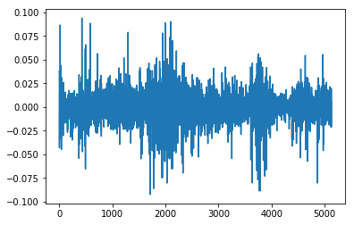
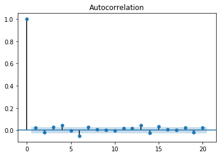
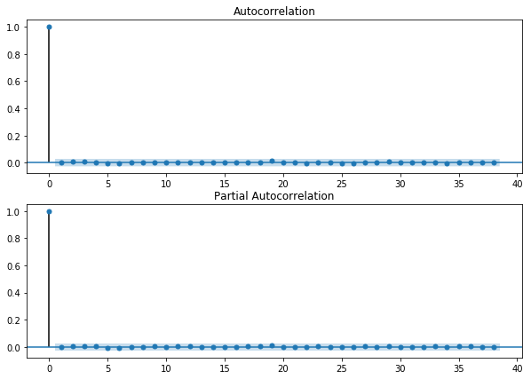
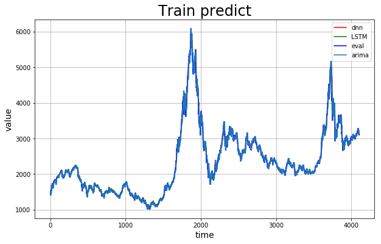
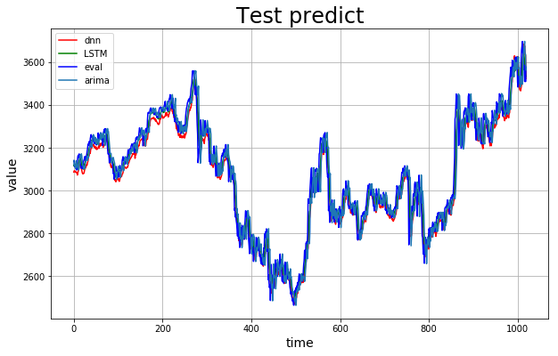

# 基于PaddlePaddle的A股预测

> 本项目尝试通过百度自研PaddlePaddle框架实现深度神经网络DNN和长短期记忆网络LSTM来对A股进行预测，使用数据为2000-2021年上证指数的数据

本项目[Github仓库](https://github.com/chaoers/stock-prediction)

## 运行环境


```python
# -*- coding: utf-8 -*-

%matplotlib inline

import pandas as pd
import numpy as np
import matplotlib.pyplot as plt
from sklearn.preprocessing import MinMaxScaler

import paddle
import paddle.fluid as fluid
import paddle.fluid.layers as layers

import statsmodels.api as sm 
from statsmodels.graphics.api import qqplot
from statsmodels.tsa.arima_model import ARIMA
import math
```

### GPU(CPU)调用


```python
# place = fluid.CUDAPlace(0) # GPU环境用这个
place = fluid.CPUPlace() # CPU环境用这个
```

## 数据清洗

### 导入数据


```python
data_pd = pd.read_csv('./data/data72449/shangzheng.csv')
```

### 查看数据头部


```python
data_pd.head()
# data_pd.tail()
# data_pd.describe()
# data_pd.info()
```


<div>
<style scoped>
    .dataframe tbody tr th:only-of-type {
        vertical-align: middle;
    }

    .dataframe tbody tr th {
        vertical-align: top;
    }

    .dataframe thead th {
        text-align: right;
    }
</style>
<table border="1" class="dataframe">
  <thead>
    <tr style="text-align: right;">
      <th></th>
      <th>date</th>
      <th>over</th>
      <th>begin</th>
      <th>high</th>
      <th>low</th>
      <th>trade</th>
      <th>wave</th>
    </tr>
  </thead>
  <tbody>
    <tr>
      <th>0</th>
      <td>2000年1月4日</td>
      <td>1406.37</td>
      <td>1368.69</td>
      <td>1407.52</td>
      <td>1361.21</td>
      <td>437.09M</td>
      <td>2.91%</td>
    </tr>
    <tr>
      <th>1</th>
      <td>2000年1月5日</td>
      <td>1409.68</td>
      <td>1407.83</td>
      <td>1433.78</td>
      <td>1398.32</td>
      <td>688.09M</td>
      <td>0.24%</td>
    </tr>
    <tr>
      <th>2</th>
      <td>2000年1月6日</td>
      <td>1463.94</td>
      <td>1406.04</td>
      <td>1463.95</td>
      <td>1400.25</td>
      <td>809.05M</td>
      <td>3.85%</td>
    </tr>
    <tr>
      <th>3</th>
      <td>2000年1月7日</td>
      <td>1516.60</td>
      <td>1477.15</td>
      <td>1522.83</td>
      <td>1477.15</td>
      <td>1.60B</td>
      <td>3.60%</td>
    </tr>
    <tr>
      <th>4</th>
      <td>2000年1月10日</td>
      <td>1545.11</td>
      <td>1531.71</td>
      <td>1546.72</td>
      <td>1506.40</td>
      <td>1.51B</td>
      <td>1.88%</td>
    </tr>
  </tbody>
</table>
</div>


### 异常项清洗


```python
data_pd.info() # 没有异常项需要处理
```

    <class 'pandas.core.frame.DataFrame'>
    RangeIndex: 5130 entries, 0 to 5129
    Data columns (total 7 columns):
     #   Column  Non-Null Count  Dtype  
    ---  ------  --------------  -----  
     0   date    5130 non-null   object 
     1   over    5130 non-null   float64
     2   begin   5130 non-null   float64
     3   high    5130 non-null   float64
     4   low     5130 non-null   float64
     5   trade   5130 non-null   object 
     6   wave    5130 non-null   object 
    dtypes: float64(4), object(3)
    memory usage: 280.7+ KB


### 画图查看数据


```python
plt.plot(data_pd['over'])
```


    [<matplotlib.lines.Line2D at 0x7f0c27ff9a50>]


### 提取需要数据并格式化


```python
data_pd.set_index('date', inplace=True)
data_pd.drop(columns=['trade', 'wave'], inplace=True)
data_pd.head()
```


<div>
<style scoped>
    .dataframe tbody tr th:only-of-type {
        vertical-align: middle;
    }

    .dataframe tbody tr th {
        vertical-align: top;
    }

    .dataframe thead th {
        text-align: right;
    }
</style>
<table border="1" class="dataframe">
  <thead>
    <tr style="text-align: right;">
      <th></th>
      <th>over</th>
      <th>begin</th>
      <th>high</th>
      <th>low</th>
    </tr>
    <tr>
      <th>date</th>
      <th></th>
      <th></th>
      <th></th>
      <th></th>
    </tr>
  </thead>
  <tbody>
    <tr>
      <th>2000年1月4日</th>
      <td>1406.37</td>
      <td>1368.69</td>
      <td>1407.52</td>
      <td>1361.21</td>
    </tr>
    <tr>
      <th>2000年1月5日</th>
      <td>1409.68</td>
      <td>1407.83</td>
      <td>1433.78</td>
      <td>1398.32</td>
    </tr>
    <tr>
      <th>2000年1月6日</th>
      <td>1463.94</td>
      <td>1406.04</td>
      <td>1463.95</td>
      <td>1400.25</td>
    </tr>
    <tr>
      <th>2000年1月7日</th>
      <td>1516.60</td>
      <td>1477.15</td>
      <td>1522.83</td>
      <td>1477.15</td>
    </tr>
    <tr>
      <th>2000年1月10日</th>
      <td>1545.11</td>
      <td>1531.71</td>
      <td>1546.72</td>
      <td>1506.40</td>
    </tr>
  </tbody>
</table>
</div>


### 标准化数据

> 在这里只能通过训练集特征来对全部数据进行标准化，因为理论来说我们只知道当前时间之前的数据。详见[我的博客](https://www.asteriscum.cn/2021/03/03/53/21/), 所以这里就要确认数据集划分比例


```python
split_boundary = int(data_pd.shape[0] * 0.8)

scaler = MinMaxScaler(feature_range=(-1, 1))
scaler.fit(data_pd[:split_boundary])
data_transform = scaler.transform(data_pd)

# data_transform
```

### 建立时间滑窗，我们使用前5天数据来预测后一天的数据


```python
sequence_length = 5
delay = 1
# Generated training sequences for use in the model.
def create_sequences(values, time_steps=sequence_length+delay):
    ./img/output = []
    for i in range(len(values) - time_steps):
        ./img/output.append(values[i : (i + time_steps)])
    return np.stack(./img/output)

data = create_sequences(data_transform)
print("Training input shape: ", data.shape)
```

    Training input shape:  (5124, 6, 4)


### 划分训练集和测试集


```python
train = data[: split_boundary]
test = data[split_boundary:]

train.shape,test.shape
```


    ((4104, 6, 4), (1020, 6, 4))


### 建立batch生成器


```python
def switch_reader(is_val: bool = False):
    def reader():
        # 判断是否是验证集
        if is_val:
            # 抽取数据使用迭代器返回
            for te in test:
                yield te[:sequence_length],te[-1:][:,0]
        else:
            # 抽取数据使用迭代器返回
            for tr in train:
                yield tr[:sequence_length],tr[-1:][:,0]#只取第0列pm2.5的值为label
        
    return reader   # 注意！此处不需要带括号
```

#### 测试batch生成器


```python
batch_size = 128
train_reader = fluid.io.batch(reader=switch_reader(), batch_size=batch_size)
val_reader = fluid.io.batch(reader=switch_reader(is_val=True), batch_size=batch_size)
for data in train_reader():
    # print(data[0].shape,data[1].shape)
    train_x=np.array([x[0] for x in data],np.float32)
    train_y = np.array([x[1] for x in data]).astype('int64')
    print(train_x.shape,train_y.shape)
```

    (128, 5, 4) (128, 1)
    (128, 5, 4) (128, 1)
    (128, 5, 4) (128, 1)
    (128, 5, 4) (128, 1)
    (128, 5, 4) (128, 1)
    (128, 5, 4) (128, 1)
    (128, 5, 4) (128, 1)
    (128, 5, 4) (128, 1)
    (128, 5, 4) (128, 1)
    (128, 5, 4) (128, 1)
    (128, 5, 4) (128, 1)
    (128, 5, 4) (128, 1)
    (128, 5, 4) (128, 1)
    (128, 5, 4) (128, 1)
    (128, 5, 4) (128, 1)
    (128, 5, 4) (128, 1)
    (128, 5, 4) (128, 1)
    (128, 5, 4) (128, 1)
    (128, 5, 4) (128, 1)
    (128, 5, 4) (128, 1)
    (128, 5, 4) (128, 1)
    (128, 5, 4) (128, 1)
    (128, 5, 4) (128, 1)
    (128, 5, 4) (128, 1)
    (128, 5, 4) (128, 1)
    (128, 5, 4) (128, 1)
    (128, 5, 4) (128, 1)
    (128, 5, 4) (128, 1)
    (128, 5, 4) (128, 1)
    (128, 5, 4) (128, 1)
    (128, 5, 4) (128, 1)
    (128, 5, 4) (128, 1)
    (8, 5, 4) (8, 1)


## DNN网络

### 定义DNN网络


```python
class MyDNNModel(fluid.dygraph.Layer):
    '''
    DNN网络
    '''
    def __init__(self):
        super(MyDNNModel,self).__init__()
        self.fc1=fluid.dygraph.Linear(5*4,10,act='relu')
        self.fc2=fluid.dygraph.Linear(10,1)
        
    def forward(self,input):        # forward 定义执行实际运行时网络的执行逻辑
        '''前向计算'''
        # print('input',input.shape)
        input =fluid.layers.reshape(input,shape=[-1,5*4])
        out=self.fc1(input)
        out=self.fc2(out)
        # print(out.shape)
        return out
```

### 损失作图函数


```python
def draw_train_loss(Batchs, train_loss,eval_loss, label=""):
    # print(len(Batchs), len(train_loss), len(eval_loss))
    plt.figure(figsize=(10, 6))
    title= label + " training-eval loss"
    plt.title(title, fontsize=24)
    plt.xlabel("batch", fontsize=14)
    plt.ylabel("loss", fontsize=14)
    plt.plot(Batchs, train_loss, color='red', label='training loss')
    plt.plot(Batchs, eval_loss, color='g', label='eval loss')
    plt.legend()
    plt.grid()
    plt.savefig('./img/'+ label + '_loss.png', dpi=300)
    plt.show()

    # print(Batchs, train_loss)
```

### 开始训练

> 注：有时训练DNN会出现损失函数反常现象，这时请再次运行训练


```python
with fluid.dygraph.guard(place):
    model=MyDNNModel() #模型实例化
    model.train() #训练模式
    # opt=fluid.optimizer.SGDOptimizer(learning_rate=train_parameters['learning_strategy']['lr'], parameter_list=model.parameters())#优化器选用SGD随机梯度下降，学习率为0.001.
    opt=fluid.optimizer.AdamOptimizer(learning_rate=0.0001, parameter_list=model.parameters()) 
    epochs_num=200#迭代次数
    batch_size = 128 * 3
    train_reader = fluid.io.batch(reader=switch_reader(), batch_size=batch_size)
    val_reader = fluid.io.batch(reader=switch_reader(is_val=True), batch_size=batch_size)
    Batch=0
    Batchs=[]
    all_train_loss=[]
    all_eval_loss=[]
    for pass_num in range(epochs_num):
        for batch_id, data in enumerate(train_reader()): 
            data_x=np.array([x[0] for x in data],np.float32)
            data_y = np.array([x[1] for x in data]).astype('float32')
            data_x = fluid.dygraph.to_variable(data_x)
            data_y = fluid.dygraph.to_variable(data_y)
        
            # print(data_x.shape, data_y.shape)

            predict=model(data_x)
            # print(predict.shape)
            loss=fluid.layers.mse_loss(predict,data_y)
            avg_loss=fluid.layers.mean(loss)#获取loss值
            avg_loss.backward()       
            opt.minimize(avg_loss)    #优化器对象的minimize方法对参数进行更新 
            model.clear_gradients()   #model.clear_gradients()来重置梯度
            if batch_id!=0 and batch_id%10==0:
                Batch = Batch+10
                Batchs.append(Batch)
                all_train_loss.append(avg_loss.numpy()[0])
                evalavg_loss=[]
                for eval_data in val_reader():
                    eval_data_x = np.array([x[0] for x in eval_data],np.float32)
                    eval_data_y = np.array([x[1] for x in eval_data]).astype('float32')

                    eval_data_x = fluid.dygraph.to_variable(eval_data_x)
                    eval_data_y = fluid.dygraph.to_variable(eval_data_y)

                    eval_predict=model(eval_data_x)
                    eval_loss=fluid.layers.mse_loss(eval_predict,eval_data_y)
                    eval_loss=fluid.layers.mean(eval_loss)
                    evalavg_loss.append(eval_loss.numpy()[0])#获取loss值
                all_eval_loss.append(sum(evalavg_loss)/len(evalavg_loss))
        print("epoch:{},batch_id:{},train_loss:{},eval_loss:{}".format(pass_num,batch_id,avg_loss.numpy(),sum(evalavg_loss)/len(evalavg_loss)))     

    fluid.save_dygraph(model.state_dict(),'./model/MyDNNModel')#保存模型
    fluid.save_dygraph(opt.state_dict(),'./model/MyDNNModel')#保存模型
    print("Final loss: {}".format(avg_loss.numpy()))    
#绘制训练图和验证损失图，以了解训练的进行情况。     
draw_train_loss(Batchs,all_train_loss,all_eval_loss, 'DNN')
```

    epoch:0,batch_id:10,train_loss:[0.01952308],eval_loss:0.01870791179438432
    epoch:1,batch_id:10,train_loss:[0.01750821],eval_loss:0.01677239468942086
    epoch:2,batch_id:10,train_loss:[0.01564891],eval_loss:0.014983377885073423
    epoch:3,batch_id:10,train_loss:[0.0139363],eval_loss:0.013334243403126797
    epoch:4,batch_id:10,train_loss:[0.0123716],eval_loss:0.011824272417773804
    epoch:5,batch_id:10,train_loss:[0.01095283],eval_loss:0.01045409201954802
    epoch:6,batch_id:10,train_loss:[0.00967765],eval_loss:0.009221728891134262
    epoch:7,batch_id:10,train_loss:[0.00854252],eval_loss:0.008123515096182624
    epoch:8,batch_id:10,train_loss:[0.00753426],eval_loss:0.007150782970711589
    epoch:9,batch_id:10,train_loss:[0.00664602],eval_loss:0.006299050835271676
    epoch:10,batch_id:10,train_loss:[0.00587446],eval_loss:0.005559576054414113
    epoch:11,batch_id:10,train_loss:[0.00520018],eval_loss:0.004915598081424832
    epoch:12,batch_id:10,train_loss:[0.00460567],eval_loss:0.004347955225966871
    epoch:13,batch_id:10,train_loss:[0.00407639],eval_loss:0.0038450557428101697
    epoch:14,batch_id:10,train_loss:[0.00360428],eval_loss:0.0033987074081475535
    epoch:15,batch_id:10,train_loss:[0.00318524],eval_loss:0.003003242348010341
    epoch:16,batch_id:10,train_loss:[0.00281366],eval_loss:0.0026535658398643136
    epoch:17,batch_id:10,train_loss:[0.00248531],eval_loss:0.0023452444778134427
    epoch:18,batch_id:10,train_loss:[0.00219594],eval_loss:0.0020738504244945943
    epoch:19,batch_id:10,train_loss:[0.00194155],eval_loss:0.0018352012654456
    epoch:20,batch_id:10,train_loss:[0.00171926],eval_loss:0.0016263493259126942
    epoch:21,batch_id:10,train_loss:[0.00152628],eval_loss:0.0014449154065611463
    epoch:22,batch_id:10,train_loss:[0.00136014],eval_loss:0.0012887096187720697
    epoch:23,batch_id:10,train_loss:[0.00121864],eval_loss:0.0011556613123199593
    epoch:24,batch_id:10,train_loss:[0.00109961],eval_loss:0.0010436684436475236
    epoch:25,batch_id:10,train_loss:[0.00100103],eval_loss:0.0009507689877257993
    epoch:26,batch_id:10,train_loss:[0.00092102],eval_loss:0.0008750543347559869
    epoch:27,batch_id:10,train_loss:[0.00085773],eval_loss:0.0008148032259972146
    epoch:28,batch_id:10,train_loss:[0.00080952],eval_loss:0.0007683895237278193
    epoch:29,batch_id:10,train_loss:[0.00077453],eval_loss:0.0007340439672892293
    epoch:30,batch_id:10,train_loss:[0.00075104],eval_loss:0.0007103929043902705
    epoch:31,batch_id:10,train_loss:[0.00073769],eval_loss:0.0006961131293792278
    epoch:32,batch_id:10,train_loss:[0.00073313],eval_loss:0.0006898708622126529
    epoch:33,batch_id:10,train_loss:[0.00073609],eval_loss:0.000690331895990918
    epoch:34,batch_id:10,train_loss:[0.00074529],eval_loss:0.0006964691953423122
    epoch:35,batch_id:10,train_loss:[0.00075965],eval_loss:0.0007072909502312541
    epoch:36,batch_id:10,train_loss:[0.00077826],eval_loss:0.000721788169660916
    epoch:37,batch_id:10,train_loss:[0.00080003],eval_loss:0.0007392701615268985
    epoch:38,batch_id:10,train_loss:[0.00082422],eval_loss:0.0007590722913543383
    epoch:39,batch_id:10,train_loss:[0.00084991],eval_loss:0.0007805599792239567
    epoch:40,batch_id:10,train_loss:[0.00087669],eval_loss:0.0008032002563898762
    epoch:41,batch_id:10,train_loss:[0.0009041],eval_loss:0.0008265563519671559
    epoch:42,batch_id:10,train_loss:[0.00093172],eval_loss:0.0008501775252322356
    epoch:43,batch_id:10,train_loss:[0.00095909],eval_loss:0.0008737507547872762
    epoch:44,batch_id:10,train_loss:[0.00098585],eval_loss:0.0008969155993933479
    epoch:45,batch_id:10,train_loss:[0.00101187],eval_loss:0.0009193962129453818
    epoch:46,batch_id:10,train_loss:[0.00103677],eval_loss:0.0009409670407573382
    epoch:47,batch_id:10,train_loss:[0.00106039],eval_loss:0.0009615717766185602
    epoch:48,batch_id:10,train_loss:[0.00108274],eval_loss:0.0009811020378644268
    epoch:49,batch_id:10,train_loss:[0.00110376],eval_loss:0.0009995315340347588
    epoch:50,batch_id:10,train_loss:[0.00112347],eval_loss:0.0010168082856883605
    epoch:51,batch_id:10,train_loss:[0.00114191],eval_loss:0.0010328993278866012
    epoch:52,batch_id:10,train_loss:[0.00115889],eval_loss:0.0010477425530552864
    epoch:53,batch_id:10,train_loss:[0.00117446],eval_loss:0.0010613780080651243
    epoch:54,batch_id:10,train_loss:[0.00118863],eval_loss:0.001073821777633081
    epoch:55,batch_id:10,train_loss:[0.00120143],eval_loss:0.0010851047118194401
    epoch:56,batch_id:10,train_loss:[0.00121298],eval_loss:0.0010952539547967415
    epoch:57,batch_id:10,train_loss:[0.0012233],eval_loss:0.0011043320798004668
    epoch:58,batch_id:10,train_loss:[0.00123254],eval_loss:0.0011123439180664718
    epoch:59,batch_id:10,train_loss:[0.00124077],eval_loss:0.0011193576695707936
    epoch:60,batch_id:10,train_loss:[0.00124802],eval_loss:0.0011254257212082546
    epoch:61,batch_id:10,train_loss:[0.00125435],eval_loss:0.0011306071537546813
    epoch:62,batch_id:10,train_loss:[0.00125984],eval_loss:0.0011349700313682358
    epoch:63,batch_id:10,train_loss:[0.00126447],eval_loss:0.0011385606873470049
    epoch:64,batch_id:10,train_loss:[0.00126835],eval_loss:0.0011414415009009342
    epoch:65,batch_id:10,train_loss:[0.00127156],eval_loss:0.0011436493950895965
    epoch:66,batch_id:10,train_loss:[0.00127414],eval_loss:0.0011452347195396821
    epoch:67,batch_id:10,train_loss:[0.00127615],eval_loss:0.0011462469507629673
    epoch:68,batch_id:10,train_loss:[0.00127762],eval_loss:0.0011467249908794959
    epoch:69,batch_id:10,train_loss:[0.00127858],eval_loss:0.0011467255341509979
    epoch:70,batch_id:10,train_loss:[0.00127907],eval_loss:0.0011462917706618707
    epoch:71,batch_id:10,train_loss:[0.00127913],eval_loss:0.001145456451922655
    epoch:72,batch_id:10,train_loss:[0.00127881],eval_loss:0.0011442529891307156
    epoch:73,batch_id:10,train_loss:[0.00127814],eval_loss:0.0011427159964417417
    epoch:74,batch_id:10,train_loss:[0.00127716],eval_loss:0.001140883444653203
    epoch:75,batch_id:10,train_loss:[0.00127588],eval_loss:0.001138781236174206
    epoch:76,batch_id:10,train_loss:[0.00127433],eval_loss:0.0011364426657867928
    epoch:77,batch_id:10,train_loss:[0.00127253],eval_loss:0.0011338866509807606
    epoch:78,batch_id:10,train_loss:[0.00127049],eval_loss:0.001131131643584619
    epoch:79,batch_id:10,train_loss:[0.00126824],eval_loss:0.0011281986565639575
    epoch:80,batch_id:10,train_loss:[0.0012658],eval_loss:0.0011251029015208285
    epoch:81,batch_id:10,train_loss:[0.00126318],eval_loss:0.0011218605407824118
    epoch:82,batch_id:10,train_loss:[0.00126043],eval_loss:0.0011184830800630152
    epoch:83,batch_id:10,train_loss:[0.00125754],eval_loss:0.0011149804534701009
    epoch:84,batch_id:10,train_loss:[0.00125453],eval_loss:0.001111368202449133
    epoch:85,batch_id:10,train_loss:[0.00125142],eval_loss:0.0011076598893851042
    epoch:86,batch_id:10,train_loss:[0.00124822],eval_loss:0.0011038673692382872
    epoch:87,batch_id:10,train_loss:[0.00124492],eval_loss:0.0010999932419508696
    epoch:88,batch_id:10,train_loss:[0.00124153],eval_loss:0.001096050487831235
    epoch:89,batch_id:10,train_loss:[0.00123807],eval_loss:0.0010920423083007336
    epoch:90,batch_id:10,train_loss:[0.00123453],eval_loss:0.00108796792725722
    epoch:91,batch_id:10,train_loss:[0.00123093],eval_loss:0.0010838330684540172
    epoch:92,batch_id:10,train_loss:[0.00122728],eval_loss:0.001079647821219017
    epoch:93,batch_id:10,train_loss:[0.00122357],eval_loss:0.0010754135631335278
    epoch:94,batch_id:10,train_loss:[0.00121983],eval_loss:0.001071140228305012
    epoch:95,batch_id:10,train_loss:[0.00121604],eval_loss:0.001066831755451858
    epoch:96,batch_id:10,train_loss:[0.00121222],eval_loss:0.001062486049098273
    epoch:97,batch_id:10,train_loss:[0.00120836],eval_loss:0.001058113994076848
    epoch:98,batch_id:10,train_loss:[0.00120446],eval_loss:0.0010537025906766455
    epoch:99,batch_id:10,train_loss:[0.00120052],eval_loss:0.0010492642177268863
    epoch:100,batch_id:10,train_loss:[0.00119655],eval_loss:0.0010448036288532119
    epoch:101,batch_id:10,train_loss:[0.00119256],eval_loss:0.0010403222016369302
    epoch:102,batch_id:10,train_loss:[0.00118854],eval_loss:0.001035818791327377
    epoch:103,batch_id:10,train_loss:[0.00118449],eval_loss:0.001031298190355301
    epoch:104,batch_id:10,train_loss:[0.00118041],eval_loss:0.0010267629016501207
    epoch:105,batch_id:10,train_loss:[0.00117632],eval_loss:0.001022222141424815
    epoch:106,batch_id:10,train_loss:[0.00117221],eval_loss:0.0010176726694529255
    epoch:107,batch_id:10,train_loss:[0.00116809],eval_loss:0.0010131075784253578
    epoch:108,batch_id:10,train_loss:[0.00116396],eval_loss:0.0010085216102500756
    epoch:109,batch_id:10,train_loss:[0.00115983],eval_loss:0.0010039247184370954
    epoch:110,batch_id:10,train_loss:[0.00115568],eval_loss:0.0009993188044366736
    epoch:111,batch_id:10,train_loss:[0.00115152],eval_loss:0.0009946982997159164
    epoch:112,batch_id:10,train_loss:[0.00114735],eval_loss:0.0009900708100758493
    epoch:113,batch_id:10,train_loss:[0.00114317],eval_loss:0.0009854359474654
    epoch:114,batch_id:10,train_loss:[0.00113898],eval_loss:0.0009807930133926372
    epoch:115,batch_id:10,train_loss:[0.00113479],eval_loss:0.0009761397183562318
    epoch:116,batch_id:10,train_loss:[0.00113059],eval_loss:0.0009714714639509717
    epoch:117,batch_id:10,train_loss:[0.00112638],eval_loss:0.0009667969037157794
    epoch:118,batch_id:10,train_loss:[0.00112215],eval_loss:0.00096211446604381
    epoch:119,batch_id:10,train_loss:[0.00111793],eval_loss:0.0009574232390150428
    epoch:120,batch_id:10,train_loss:[0.00111371],eval_loss:0.0009527291792134444
    epoch:121,batch_id:10,train_loss:[0.00110948],eval_loss:0.0009480201794455448
    epoch:122,batch_id:10,train_loss:[0.00110525],eval_loss:0.0009433097632912298
    epoch:123,batch_id:10,train_loss:[0.00110101],eval_loss:0.0009385966307794055
    epoch:124,batch_id:10,train_loss:[0.00109677],eval_loss:0.0009338843325773875
    epoch:125,batch_id:10,train_loss:[0.00109253],eval_loss:0.0009291724612315496
    epoch:126,batch_id:10,train_loss:[0.00108829],eval_loss:0.0009244605122754971
    epoch:127,batch_id:10,train_loss:[0.00108404],eval_loss:0.0009197492036037147
    epoch:128,batch_id:10,train_loss:[0.00107979],eval_loss:0.0009150334711497029
    epoch:129,batch_id:10,train_loss:[0.00107552],eval_loss:0.0009103096866359314
    epoch:130,batch_id:10,train_loss:[0.00107124],eval_loss:0.0009055749784844617
    epoch:131,batch_id:10,train_loss:[0.00106697],eval_loss:0.0009008403673457602
    epoch:132,batch_id:10,train_loss:[0.0010627],eval_loss:0.0008961039517695705
    epoch:133,batch_id:10,train_loss:[0.00105844],eval_loss:0.0008913745793203512
    epoch:134,batch_id:10,train_loss:[0.00105419],eval_loss:0.0008866394055075943
    epoch:135,batch_id:10,train_loss:[0.00104994],eval_loss:0.0008818982169032097
    epoch:136,batch_id:10,train_loss:[0.00104569],eval_loss:0.0008771513433506092
    epoch:137,batch_id:10,train_loss:[0.00104144],eval_loss:0.0008724070697401961
    epoch:138,batch_id:10,train_loss:[0.00103719],eval_loss:0.0008676636692446967
    epoch:139,batch_id:10,train_loss:[0.00103295],eval_loss:0.0008629131674145659
    epoch:140,batch_id:10,train_loss:[0.0010287],eval_loss:0.0008581670117564499
    epoch:141,batch_id:10,train_loss:[0.00102445],eval_loss:0.0008534224471077323
    epoch:142,batch_id:10,train_loss:[0.00102022],eval_loss:0.0008486806182190776
    epoch:143,batch_id:10,train_loss:[0.001016],eval_loss:0.0008439434071381887
    epoch:144,batch_id:10,train_loss:[0.00101179],eval_loss:0.0008392060796419779
    epoch:145,batch_id:10,train_loss:[0.00100756],eval_loss:0.0008344772310617069
    epoch:146,batch_id:10,train_loss:[0.00100333],eval_loss:0.000829748964558045
    epoch:147,batch_id:10,train_loss:[0.00099911],eval_loss:0.0008250166623232266
    epoch:148,batch_id:10,train_loss:[0.00099489],eval_loss:0.0008202902972698212
    epoch:149,batch_id:10,train_loss:[0.00099068],eval_loss:0.0008155756901639203
    epoch:150,batch_id:10,train_loss:[0.00098646],eval_loss:0.0008108668650190035
    epoch:151,batch_id:10,train_loss:[0.00098226],eval_loss:0.0008061605816086134
    epoch:152,batch_id:10,train_loss:[0.00097805],eval_loss:0.0008014530564347903
    epoch:153,batch_id:10,train_loss:[0.00097386],eval_loss:0.0007967533310875297
    epoch:154,batch_id:10,train_loss:[0.00096966],eval_loss:0.0007920613667617241
    epoch:155,batch_id:10,train_loss:[0.00096546],eval_loss:0.0007873766977960864
    epoch:156,batch_id:10,train_loss:[0.00096126],eval_loss:0.0007826989749446511
    epoch:157,batch_id:10,train_loss:[0.00095707],eval_loss:0.0007780169641288618
    epoch:158,batch_id:10,train_loss:[0.00095287],eval_loss:0.0007733322757606705
    epoch:159,batch_id:10,train_loss:[0.00094868],eval_loss:0.0007686497992835939
    epoch:160,batch_id:10,train_loss:[0.00094448],eval_loss:0.0007639721152372658
    epoch:161,batch_id:10,train_loss:[0.00094028],eval_loss:0.0007593041324677566
    epoch:162,batch_id:10,train_loss:[0.00093611],eval_loss:0.0007546453271061182
    epoch:163,batch_id:10,train_loss:[0.00093194],eval_loss:0.0007499853381887078
    epoch:164,batch_id:10,train_loss:[0.00092778],eval_loss:0.0007453300252867242
    epoch:165,batch_id:10,train_loss:[0.00092362],eval_loss:0.0007406838315849503
    epoch:166,batch_id:10,train_loss:[0.00091947],eval_loss:0.0007360496480638782
    epoch:167,batch_id:10,train_loss:[0.00091532],eval_loss:0.0007314271060749888
    epoch:168,batch_id:10,train_loss:[0.00091119],eval_loss:0.0007268087356351316
    epoch:169,batch_id:10,train_loss:[0.00090707],eval_loss:0.0007222058484330773
    epoch:170,batch_id:10,train_loss:[0.00090297],eval_loss:0.0007176294457167387
    epoch:171,batch_id:10,train_loss:[0.0008989],eval_loss:0.0007130756081702808
    epoch:172,batch_id:10,train_loss:[0.00089484],eval_loss:0.0007085320345746974
    epoch:173,batch_id:10,train_loss:[0.0008908],eval_loss:0.0007040050501624743
    epoch:174,batch_id:10,train_loss:[0.00088675],eval_loss:0.0006994910460586349
    epoch:175,batch_id:10,train_loss:[0.00088271],eval_loss:0.0006950007324727873
    epoch:176,batch_id:10,train_loss:[0.00087869],eval_loss:0.0006905312863333771
    epoch:177,batch_id:10,train_loss:[0.00087468],eval_loss:0.0006860829598736018
    epoch:178,batch_id:10,train_loss:[0.00087067],eval_loss:0.0006816522121274223
    epoch:179,batch_id:10,train_loss:[0.00086668],eval_loss:0.000677235705855613
    epoch:180,batch_id:10,train_loss:[0.0008627],eval_loss:0.0006728296866640449
    epoch:181,batch_id:10,train_loss:[0.00085873],eval_loss:0.0006684490072075278
    epoch:182,batch_id:10,train_loss:[0.00085478],eval_loss:0.0006640994009406617
    epoch:183,batch_id:10,train_loss:[0.00085086],eval_loss:0.000659770070342347
    epoch:184,batch_id:10,train_loss:[0.00084696],eval_loss:0.0006554656526229034
    epoch:185,batch_id:10,train_loss:[0.00084309],eval_loss:0.0006511901932147642
    epoch:186,batch_id:10,train_loss:[0.00083926],eval_loss:0.0006469470681622624
    epoch:187,batch_id:10,train_loss:[0.00083547],eval_loss:0.0006427357147913426
    epoch:188,batch_id:10,train_loss:[0.0008317],eval_loss:0.0006385607121046633
    epoch:189,batch_id:10,train_loss:[0.00082796],eval_loss:0.000634433546413978
    epoch:190,batch_id:10,train_loss:[0.00082426],eval_loss:0.0006303602131083608
    epoch:191,batch_id:10,train_loss:[0.00082061],eval_loss:0.0006263428658712655
    epoch:192,batch_id:10,train_loss:[0.00081701],eval_loss:0.0006223896634764969
    epoch:193,batch_id:10,train_loss:[0.00081348],eval_loss:0.0006185064654952536
    epoch:194,batch_id:10,train_loss:[0.00081002],eval_loss:0.0006146971912433704
    epoch:195,batch_id:10,train_loss:[0.00080664],eval_loss:0.000610976159805432
    epoch:196,batch_id:10,train_loss:[0.00080333],eval_loss:0.0006073508508658657
    epoch:197,batch_id:10,train_loss:[0.00080011],eval_loss:0.0006038243688332537
    epoch:198,batch_id:10,train_loss:[0.00079698],eval_loss:0.0006004076082414637
    epoch:199,batch_id:10,train_loss:[0.00079395],eval_loss:0.0005971040712514272
    Final loss: [0.00079395]


## LSTM网络

### 定义LSTM网络


```python
import paddle.fluid as fluid
class MyLSTMModel(fluid.dygraph.Layer):
    '''
    LSTM网络
    '''
    def __init__(self):
        super(MyLSTMModel,self).__init__()
        self.rnn = paddle.nn.LSTM(4, 20, 2)
        self.flatten = paddle.nn.Flatten()
        self.fc1=fluid.dygraph.Linear(5*20,10)
        self.fc2=fluid.dygraph.Linear(10,1)

        
    def forward(self,input):        # forward 定义执行实际运行时网络的执行逻辑
        '''前向计算'''
        # print('input',input.shape)
        out, (h, c)=self.rnn(input)
        out =self.flatten(out)
        out=self.fc1(out)
        out=self.fc2(out)
        return out
```

### 开始训练


```python
with fluid.dygraph.guard(place):
    model=MyLSTMModel() #模型实例化
    # model=MyModel()
    model.train() #训练模式
    # opt=fluid.optimizer.SGDOptimizer(learning_rate=0.001, parameter_list=model.parameters())#优化器选用SGD随机梯度下降，学习率为0.001.
    opt=fluid.optimizer.AdamOptimizer(learning_rate=0.01, parameter_list=model.parameters()) 
    epochs_num=100#迭代次数
    batch_size = 128*3
    train_reader = fluid.io.batch(reader=switch_reader(), batch_size=batch_size)
    val_reader = fluid.io.batch(reader=switch_reader(is_val=True), batch_size=batch_size)
    Batch=0
    Batchs=[]
    all_train_loss=[]
    all_eval_loss=[]
    for pass_num in range(epochs_num):
        for batch_id, data in enumerate(train_reader()): 
            data_x=np.array([x[0] for x in data],np.float32)
            data_y = np.array([x[1] for x in data]).astype('float32')
            data_x = fluid.dygraph.to_variable(data_x)
            data_y = fluid.dygraph.to_variable(data_y)
        
            # print(data_x.shape, data_y.shape)

            predict=model(data_x)
            # print(predict.shape)
            loss=fluid.layers.mse_loss(predict,data_y)
            avg_loss=fluid.layers.mean(loss)#获取loss值
            avg_loss.backward()       
            opt.minimize(avg_loss)    #优化器对象的minimize方法对参数进行更新 
            model.clear_gradients()   #model.clear_gradients()来重置梯度
            if batch_id!=0 and batch_id%10==0:
                Batch = Batch+10
                Batchs.append(Batch)
                all_train_loss.append(avg_loss.numpy()[0])
                evalavg_loss=[]
                for eval_data in val_reader():
                    eval_data_x = np.array([x[0] for x in eval_data],np.float32)
                    eval_data_y = np.array([x[1] for x in eval_data]).astype('float32')

                    eval_data_x = fluid.dygraph.to_variable(eval_data_x)
                    eval_data_y = fluid.dygraph.to_variable(eval_data_y)

                    eval_predict=model(eval_data_x)
                    eval_loss=fluid.layers.mse_loss(eval_predict,eval_data_y)
                    eval_loss=fluid.layers.mean(eval_loss)
                    evalavg_loss.append(eval_loss.numpy()[0])#获取loss值
                all_eval_loss.append(sum(evalavg_loss)/len(evalavg_loss))
        print("epoch:{},batch_id:{},train_loss:{},eval_loss:{}".format(pass_num,batch_id,avg_loss.numpy(),sum(evalavg_loss)/len(evalavg_loss)))     

    fluid.save_dygraph(model.state_dict(),'./model/MyLSTMModel')#保存模型
    fluid.save_dygraph(opt.state_dict(),'./model/MyLSTMModel')#保存模型
    print("Final loss: {}".format(avg_loss.numpy()))    
#让我们绘制训练图和验证损失图，以了解训练的进行情况。     
draw_train_loss(Batchs,all_train_loss,all_eval_loss, 'LSTM')
```

    epoch:0,batch_id:10,train_loss:[0.01361275],eval_loss:0.02257246244698763
    epoch:1,batch_id:10,train_loss:[0.07703531],eval_loss:0.05712037657697996
    epoch:2,batch_id:10,train_loss:[0.01176795],eval_loss:0.02054892232020696
    epoch:3,batch_id:10,train_loss:[0.00269285],eval_loss:0.0015266626918067534
    epoch:4,batch_id:10,train_loss:[0.00181504],eval_loss:0.0017056632398938139
    epoch:5,batch_id:10,train_loss:[0.0031247],eval_loss:0.001436287226776282
    epoch:6,batch_id:10,train_loss:[0.00093001],eval_loss:0.0006579701439477503
    epoch:7,batch_id:10,train_loss:[0.00105162],eval_loss:0.0013829594245180488
    epoch:8,batch_id:10,train_loss:[0.00452445],eval_loss:0.006132860668003559
    epoch:9,batch_id:10,train_loss:[0.00180459],eval_loss:0.00112524488940835
    epoch:10,batch_id:10,train_loss:[0.00086761],eval_loss:0.0012881977211994429
    epoch:11,batch_id:10,train_loss:[0.00082518],eval_loss:0.0006624077310940871
    epoch:12,batch_id:10,train_loss:[0.00091848],eval_loss:0.0009353027562610805
    epoch:13,batch_id:10,train_loss:[0.00424617],eval_loss:0.0038703531802942357
    epoch:14,batch_id:10,train_loss:[0.00084583],eval_loss:0.001990712092568477
    epoch:15,batch_id:10,train_loss:[0.00087894],eval_loss:0.000846595037728548
    epoch:16,batch_id:10,train_loss:[0.00101296],eval_loss:0.0008815441591044267
    epoch:17,batch_id:10,train_loss:[0.00309741],eval_loss:0.0025929655336464443
    epoch:18,batch_id:10,train_loss:[0.00086339],eval_loss:0.0014270931715145707
    epoch:19,batch_id:10,train_loss:[0.00087965],eval_loss:0.0006804280080056438
    epoch:20,batch_id:10,train_loss:[0.00157523],eval_loss:0.001764695392921567
    epoch:21,batch_id:10,train_loss:[0.00212999],eval_loss:0.0012163359012144308
    epoch:22,batch_id:10,train_loss:[0.00084151],eval_loss:0.0010095871790933113
    epoch:23,batch_id:10,train_loss:[0.00123278],eval_loss:0.0005671791344260176
    epoch:24,batch_id:10,train_loss:[0.00162297],eval_loss:0.0007773475081194192
    epoch:25,batch_id:10,train_loss:[0.00248237],eval_loss:0.0011500168475322425
    epoch:26,batch_id:10,train_loss:[0.00081462],eval_loss:0.0011475766659714282
    epoch:27,batch_id:10,train_loss:[0.00163122],eval_loss:0.0005573148567539951
    epoch:28,batch_id:10,train_loss:[0.00168339],eval_loss:0.0009761870023794472
    epoch:29,batch_id:10,train_loss:[0.00317477],eval_loss:0.0012225920412068565
    epoch:30,batch_id:10,train_loss:[0.00113053],eval_loss:0.000739370366015161
    epoch:31,batch_id:10,train_loss:[0.00139581],eval_loss:0.000692838589505603
    epoch:32,batch_id:10,train_loss:[0.00166349],eval_loss:0.0012010633751439552
    epoch:33,batch_id:10,train_loss:[0.00259268],eval_loss:0.00116252014413476
    epoch:34,batch_id:10,train_loss:[0.00100794],eval_loss:0.0005626993855306258
    epoch:35,batch_id:10,train_loss:[0.00109509],eval_loss:0.000787707045674324
    epoch:36,batch_id:10,train_loss:[0.00098434],eval_loss:0.0007183792865059028
    epoch:37,batch_id:10,train_loss:[0.00151267],eval_loss:0.0008713896774376432
    epoch:38,batch_id:10,train_loss:[0.00078015],eval_loss:0.0006119609558178732
    epoch:39,batch_id:10,train_loss:[0.00088319],eval_loss:0.0005916018562857062
    epoch:40,batch_id:10,train_loss:[0.00088928],eval_loss:0.0005766860655664156
    epoch:41,batch_id:10,train_loss:[0.00093016],eval_loss:0.0005200582284790775
    epoch:42,batch_id:10,train_loss:[0.00076413],eval_loss:0.0005654180131386966
    epoch:43,batch_id:10,train_loss:[0.00082619],eval_loss:0.0005297637544572353
    epoch:44,batch_id:10,train_loss:[0.00080129],eval_loss:0.0005529284050377706
    epoch:45,batch_id:10,train_loss:[0.00083979],eval_loss:0.000496497368051981
    epoch:46,batch_id:10,train_loss:[0.00074874],eval_loss:0.0005248004357175281
    epoch:47,batch_id:10,train_loss:[0.00077444],eval_loss:0.0004955098168769231
    epoch:48,batch_id:10,train_loss:[0.00078785],eval_loss:0.0004892492725048214
    epoch:49,batch_id:10,train_loss:[0.00078989],eval_loss:0.0004870699388751139
    epoch:50,batch_id:10,train_loss:[0.00074215],eval_loss:0.0004959547562369456
    epoch:51,batch_id:10,train_loss:[0.00076349],eval_loss:0.0005157151511715105
    epoch:52,batch_id:10,train_loss:[0.00097732],eval_loss:0.0006949780508875847
    epoch:53,batch_id:10,train_loss:[0.00075754],eval_loss:0.0007195753860287368
    epoch:54,batch_id:10,train_loss:[0.00087523],eval_loss:0.00048024884502713877
    epoch:55,batch_id:10,train_loss:[0.00144369],eval_loss:0.0013219275861047208
    epoch:56,batch_id:10,train_loss:[0.00335862],eval_loss:0.0035041659915198884
    epoch:57,batch_id:10,train_loss:[0.00142394],eval_loss:0.0018255746302505333
    epoch:58,batch_id:10,train_loss:[0.00191593],eval_loss:0.0010744735094097753
    epoch:59,batch_id:10,train_loss:[0.00227668],eval_loss:0.0033481190524374447
    epoch:60,batch_id:10,train_loss:[0.00391345],eval_loss:0.005916488356888294
    epoch:61,batch_id:10,train_loss:[0.00324442],eval_loss:0.003367291996255517
    epoch:62,batch_id:10,train_loss:[0.00315646],eval_loss:0.00334006454795599
    epoch:63,batch_id:10,train_loss:[0.00108563],eval_loss:0.003056777330736319
    epoch:64,batch_id:10,train_loss:[0.0007073],eval_loss:0.000559821327139313
    epoch:65,batch_id:10,train_loss:[0.00270329],eval_loss:0.002359088296846797
    epoch:66,batch_id:10,train_loss:[0.00628839],eval_loss:0.008836616141100725
    epoch:67,batch_id:10,train_loss:[0.00094535],eval_loss:0.002074603457003832
    epoch:68,batch_id:10,train_loss:[0.0012175],eval_loss:0.0017047669971361756
    epoch:69,batch_id:10,train_loss:[0.00104491],eval_loss:0.0019784989999607205
    epoch:70,batch_id:10,train_loss:[0.00115884],eval_loss:0.0008049518801271915
    epoch:71,batch_id:10,train_loss:[0.001396],eval_loss:0.0005666382203344256
    epoch:72,batch_id:10,train_loss:[0.00109728],eval_loss:0.0006751868738016734
    epoch:73,batch_id:10,train_loss:[0.00095418],eval_loss:0.0011370941647328436
    epoch:74,batch_id:10,train_loss:[0.00127734],eval_loss:0.0009722078102640808
    epoch:75,batch_id:10,train_loss:[0.00130155],eval_loss:0.0007062011087934176
    epoch:76,batch_id:10,train_loss:[0.00102986],eval_loss:0.0004907012432037542
    epoch:77,batch_id:10,train_loss:[0.00076195],eval_loss:0.00045613105370042223
    epoch:78,batch_id:10,train_loss:[0.00083282],eval_loss:0.0004787631817938139
    epoch:79,batch_id:10,train_loss:[0.00078722],eval_loss:0.0004519826519147803
    epoch:80,batch_id:10,train_loss:[0.00078096],eval_loss:0.0004479311270794521
    epoch:81,batch_id:10,train_loss:[0.00072044],eval_loss:0.0004395548797522982
    epoch:82,batch_id:10,train_loss:[0.0007339],eval_loss:0.00044069670063133043
    epoch:83,batch_id:10,train_loss:[0.00073348],eval_loss:0.0004330223018769175
    epoch:84,batch_id:10,train_loss:[0.0007108],eval_loss:0.000425596105439278
    epoch:85,batch_id:10,train_loss:[0.00067659],eval_loss:0.00042267518195634085
    epoch:86,batch_id:10,train_loss:[0.00069295],eval_loss:0.0004222738352837041
    epoch:87,batch_id:10,train_loss:[0.00068375],eval_loss:0.00041880674931841594
    epoch:88,batch_id:10,train_loss:[0.00067919],eval_loss:0.00041327092427915585
    epoch:89,batch_id:10,train_loss:[0.00064283],eval_loss:0.00041765242349356413
    epoch:90,batch_id:10,train_loss:[0.00065441],eval_loss:0.00040834058017935604
    epoch:91,batch_id:10,train_loss:[0.00066078],eval_loss:0.0004043803928652778
    epoch:92,batch_id:10,train_loss:[0.00065543],eval_loss:0.00040361414236637455
    epoch:93,batch_id:10,train_loss:[0.00061593],eval_loss:0.00041695283046768356
    epoch:94,batch_id:10,train_loss:[0.00063482],eval_loss:0.0004004844377050176
    epoch:95,batch_id:10,train_loss:[0.00063286],eval_loss:0.0004010664173013841
    epoch:96,batch_id:10,train_loss:[0.00063528],eval_loss:0.0003881224207968141
    epoch:97,batch_id:10,train_loss:[0.00060516],eval_loss:0.00040616420543907833
    epoch:98,batch_id:10,train_loss:[0.00060162],eval_loss:0.0003840138524537906
    epoch:99,batch_id:10,train_loss:[0.00059576],eval_loss:0.0003870877214164163
    Final loss: [0.00059576]


## ARIMA

### 从数据图可知，该数据不是平稳数据。 这里选择取对数的方式进行处理。


```python
data_arma = np.log(data_pd['over'].values)

data_arma_diff = np.diff(data_arma)[1:]

plt.plot(data_arma_diff)
```


    [<matplotlib.lines.Line2D at 0x7f0c27e78c90>]





### 进行ADF检验这里有99%把握拒绝原假设，即序列稳定


```python
# ADF检验，验证是否为平稳数据
print('数据ADF检验：',sm.tsa.stattools.adfuller(data_arma_diff))
```

    数据ADF检验： (-16.832939284099503, 1.1541145534317975e-29, 14, 5113, {'1%': -3.4316295982872163, '5%': -2.862105446825125, '10%': -2.5670709875579742}, -28114.78953050096)


### 自相关图截尾 q=1


```python
# 画自相关图
fig = sm.graphics.tsa.plot_acf(data_arma_diff,lags=20)
```





```python
# 画偏自相关图
fig = sm.graphics.tsa.plot_pacf(data_arma_diff,lags=20)
```


```python
# ARIMA（p,d,q）模型选择
# p可选1；q可选1,2
# ARIMA（2,1,0）模型为最优，值最小

# ARIMA（1,1,0）模型
arima_mod10 = sm.tsa.arima.ARIMA(data_arma,order=(1,1,0)).fit()
print(arima_mod10.aic,arima_mod10.bic,arima_mod10.hqic)

# ARIMA（2,1,0）模型
arima_mod20 = sm.tsa.arima.ARIMA(data_arma,order=(2,1,0)).fit()
print(arima_mod20.aic,arima_mod20.bic,arima_mod20.hqic)

# ARIMA（2,1,2）模型
arima_mod22 = sm.tsa.arima.ARIMA(data_arma,order=(2,1,2)).fit()
print(arima_mod22.aic,arima_mod22.bic,arima_mod22.hqic)

# ARIMA（2,1,1）模型
arima_mod21 = sm.tsa.arima.ARIMA(data_arma,order=(2,1,1)).fit()
print(arima_mod21.aic,arima_mod21.bic,arima_mod21.hqic)
```

    -28216.94080446194 -28203.85547248716 -28212.36051191957
    -28216.65350553987 -28197.025507577702 -28209.783066726315
    -28220.09157165933 -28187.378241722385 -28208.6408403034


    /opt/conda/envs/python35-paddle120-env/lib/python3.7/site-packages/statsmodels/tsa/statespace/sarimax.py:966: UserWarning: Non-stationary starting autoregressive parameters found. Using zeros as starting parameters.
      warn('Non-stationary starting autoregressive parameters'
    /opt/conda/envs/python35-paddle120-env/lib/python3.7/site-packages/statsmodels/tsa/statespace/sarimax.py:978: UserWarning: Non-invertible starting MA parameters found. Using zeros as starting parameters.
      warn('Non-invertible starting MA parameters found.'


    -28214.711599602502 -28188.540935652945 -28205.55101451776


```python
# 模型检验,检验残差序列
arima_mod=arima_mod10
resid = arima_mod.resid
fig = plt.figure(figsize=(10,7))
ax1 = fig.add_subplot(211)
fig = sm.graphics.tsa.plot_acf(resid,ax=ax1)
ax2 = fig.add_subplot(212)
fig = sm.graphics.tsa.plot_pacf(resid,ax=ax2)
```





```python
print(sm.stats.durbin_watson(arima_mod.resid))
```

    1.0221139759680866


## 训练结果

### 预测结果

#### 数据集还原函数

> 开始时标准化的数据需要在实际作图时还原


```python
def inverse_transform(arr):
    zero_arr = np.zeros((arr.shape[0], 3))
    zero_data = np.hstack((arr, zero_arr))
    # print(zero_data)
    zero_data = scaler.inverse_transform(zero_data)
    # print(zero_data)
    
    return zero_data[:, 0]

```

#### 训练集数据预测结果


```python
with fluid.dygraph.guard(place):
    accs = []
    dnn_predict = []
    model_lstm_dict, _ = fluid.load_dygraph('./model/MyLSTMModel.pdopt')
    model_dnn_dict, _ = fluid.load_dygraph('./model/MyDNNModel.pdopt')
    model_lstm = MyLSTMModel()
    model_dnn = MyDNNModel()
    model_lstm.load_dict(model_lstm_dict)
    model_dnn.load_dict(model_dnn_dict) #加载模型参数

    train_reader = fluid.io.batch(reader=switch_reader(is_val=False), batch_size=train.shape[0])
    train_data_x = np.array([x[0] for x in next(train_reader())],np.float32)
    train_data_y = np.array([x[1] for x in next(train_reader())]).astype('float32')

    train_data_x = fluid.dygraph.to_variable(train_data_x)
    train_data_y = fluid.dygraph.to_variable(train_data_y)

    train_dnn=model_dnn(train_data_x)
    train_lstm=model_lstm(train_data_x)

train_arma = arima_mod.predict(1, train.shape[0])
train_arma = math.e**(train_arma)

plt.figure(figsize=(10, 6))
title="Train predict"
plt.title(title, fontsize=24)
plt.xlabel("time", fontsize=14)
plt.ylabel("value", fontsize=14)
plt.plot(range(train.shape[0]), inverse_transform(train_dnn.numpy()), color='red', label='dnn')
plt.plot(range(train.shape[0]), inverse_transform(train_lstm.numpy()), color='g', label='LSTM')
plt.plot(range(train.shape[0]), inverse_transform(train_data_y.numpy()), color='b', label='eval')
plt.plot(range(train.shape[0]), train_arma, label='arima')
plt.legend()
plt.grid()
plt.savefig('./img/train_res.png', dpi=300)
plt.show()
```





#### 验证集预测结果


```python
with fluid.dygraph.guard(place):
    accs = []
    dnn_predict = []
    model_lstm_dict, _ = fluid.load_dygraph('./model/MyLSTMModel.pdopt')
    model_dnn_dict, _ = fluid.load_dygraph('./model/MyDNNModel.pdopt')
    model_lstm = MyLSTMModel()
    model_dnn = MyDNNModel()
    model_lstm.load_dict(model_lstm_dict)
    model_dnn.load_dict(model_dnn_dict) #加载模型参数

    val_reader = fluid.io.batch(reader=switch_reader(is_val=True), batch_size=test.shape[0])
    # print(len(next(val_reader())))
    eval_data_x = np.array([x[0] for x in next(val_reader())],np.float32)
    eval_data_y = np.array([x[1] for x in next(val_reader())]).astype('float32')

    eval_data_x = fluid.dygraph.to_variable(eval_data_x)
    eval_data_y = fluid.dygraph.to_variable(eval_data_y)

    eval_dnn=model_dnn(eval_data_x)
    eval_lstm=model_lstm(eval_data_x)

test_arma = arima_mod.predict(train.shape[0]+1, train.shape[0]+test.shape[0])
test_arma = math.e**(test_arma)

plt.figure(figsize=(10, 6))
title="Test predict"
plt.title(title, fontsize=24)
plt.xlabel("time", fontsize=14)
plt.ylabel("value", fontsize=14)
plt.plot(range(test.shape[0]), inverse_transform(eval_dnn.numpy()), color='red', label='dnn')
plt.plot(range(test.shape[0]), inverse_transform(eval_lstm.numpy()), color='g', label='LSTM')
plt.plot(range(test.shape[0]), inverse_transform(eval_data_y.numpy()), color='b', label='eval')
plt.plot(range(test.shape[0]), test_arma, label='arima')
plt.legend()
plt.grid()
plt.savefig('./img/test_res.png', dpi=300)
plt.show()

```





## 模型改进

- 本项目两模型每次训练结果具有差异性(LSTM稳定性较好一点，DNN稳定性较差)，预测结果不理想时可以尝试再次训练
- 同时模型结构未做很多尝试，在训练过程中尝试改变模型参数(模型层数，节点数量等)发现预测效果好上不少，应该还有很大的提升空间，小伙伴们可以尝试一下

## 关于作者

### Xiyan Li

> 西安交通大学 金禾经济研究中心 本科在读

- Mail：qq2542725243@stu.xjtu.edu.cn

### Asterisk(Fan Guofan)

> 西安交通大学 生物技术(生物信息学方向) 本科在读

- Mail: [fanguofan@asteriscum.cn](mailto:fanguofan@asteriscum.cn)
- Github: [chaoers](https://github.com/chaoers)
- 个人博客: [饭饭的快乐屋](https://www.asteriscum.cn)
- Ai studio: [Asterisk](https://aistudio.baidu.com/aistudio/personalcenter/thirdview/686105)
